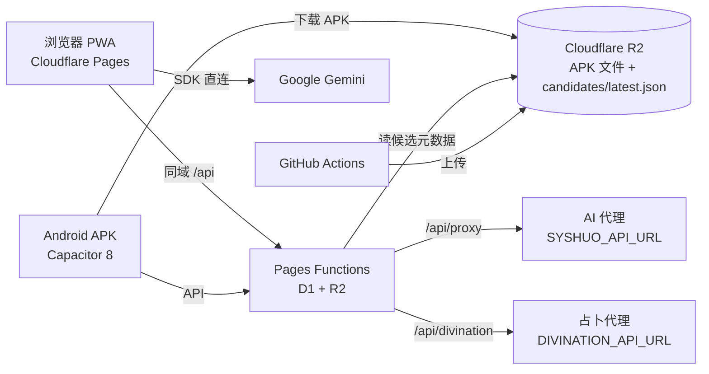

<p align="center">
    <a href="https://linux.do" alt="LINUX DO">
        </a>
</p>

# 叙说·春信 (Chunxin)

[](#前置环境)
[](https://react.dev/)
[](https://www.typescriptlang.org/)
[](https://capacitorjs.com/)
[](#验证命令)
[](#部署方式)

一个**AI 角色扮演 + 朋友圈 + 占卜 + 多端同步**的全栈应用。前端 PWA + Android APK 双形态，后端走 Cloudflare Pages Functions + D1 + R2。

> **三条最快的进入路径**：
> - 全局印象 → [`docs/architecture.md`](docs/architecture.md)
> - 改代码 / 修 Bug → [`docs/project-map.md`](docs/project-map.md)
> - 自部署 → [`docs/pages-functions-deploy.md`](docs/pages-functions-deploy.md)

## 项目特点

- **数据完全自主可控**：IndexedDB 存本地、SQLite 存自托管后端，没有第三方云。
- **AI 双模式**：用户可以走自己配置的 Gemini Key 直连，或者走后端代理（保护上游 Key、统一鉴权 / 限流 / 熔断）。
- **皮肤即布局**：12 套内置皮肤不只是配色——圆角、字号、行高、列表密度、聊天气泡、桌面侧边栏宽度全部各自一套，模仿不同 IM 产品的视觉语言。
- **多端同一份代码**：同一个 React 组件树跑在 Web、PWA、Android Capacitor、桌面模式下，靠 `nativeService.ts` 桥接差异。
- **APK 候选 / 发布分离**：CI 上传 R2 不会自动推送给用户，必须管理员在后台手动"发布候选包"才生效。
- **占卜流式 SSE**：7 种占卜全部走后端 SSE 透传，保护上游 API Key，前端实时渲染 token。

## 核心特性

| 域 | 能力 |
| --- | --- |
| 聊天 | AI 角色扮演聊天、表情、语音、特殊消息（旁白 / 心声 / 动作）、撤回、转发、收藏、世界书 |
| 联系人 | 联系人卡片、人格设置、面具切换、长期记忆、好友请求、群组 |
| 朋友圈 | 发布 / 评论 / 点赞、AI 自动生成内容、风格设置 |
| 设置 | 12 套内置皮肤 + DIY 主题、19 项高级覆盖、AI 配置、世界书 |
| 占卜 | 7 种占卜（日家奇门、六爻、梅花、奇门遁甲、三山国王灵签、塔罗多牌阵 / 单牌） |
| 信箱 | 写信 / 收信 / AI 自动回信 |
| 公众号 | AI 生成的"公众号文章"形态阅读 |
| 论坛 | 多身份发帖、归档 |
| 钱包 | 模拟余额、银行卡 |
| 音乐 | 在线搜索、本地曲库、播放器、和好友"一起听" |
| 社区 | 用户分享上传 / 浏览 / 点赞 / 举报 |
| 后台 | 公告、APK 版本管理、社区审核、口令管理、AI 配置 |
| 移动端 | Capacitor 8 Android、APK 自更新、键盘 / 安全区兼容 |
| 桌面模式 | 大屏自适应壳层、左侧导航 |

## 架构总览



要点：

- **Cloudflare Pages + Pages Functions + D1 + R2**：前台、社区、口令、APK 元数据全部跑在 Cloudflare 上。
- APK 候选包通过 GitHub Actions 上传到 R2，**最终发布由后台手动控制**。
- 内置 AI 代理与 Gemini 直连双模式，用户二选一。
- 占卜走 Pages Functions SSE 透传，保护上游 API Key。

## 仓库结构

```
chunxin/
├── src/                # 前端代码（22 文件 + 20 子目录全部在此）
│   ├── App.tsx · AppCore.tsx · AppShell.tsx · DesktopModeShell.tsx
│   ├── chatroom/  moments/  settings/  community/  music/  mailbox/
│   ├── official/  forum/  finance/  admin/  pages/  profile/  tabs/  shell/
│   ├── hooks/   services/   utils/   types/   compat/   app/
│   ├── render-engine.ts · render-schema.ts · types.ts
│   └── index.tsx · index.css · vite-env.d.ts
├── functions/          # Cloudflare Pages Functions 入口
├── cloudflare/         # Pages Functions + D1/R2 共享逻辑
├── android/            # Capacitor Android 工程
├── tests/              # 前端逻辑测试（node:assert/strict）
├── docs/               # 项目文档（本文件夹）
├── scripts/            # 仓库脚本（gx.js / run-tests.js / resolveApkReleaseMeta.js）
├── public/             # 静态资源 + _redirects
├── .github/workflows/  # apk-release
├── package.json        · vite.config.ts  · tailwind.config.cjs
├── tsconfig.json       · capacitor.config.ts · postcss.config.cjs
└── index.html
```

仓库根**不包含**任何前端源代码，所有 `.tsx` / `.ts` / `.css` 都在 `src/` 下。配置文件留在根。

## 快速开始

### 前置环境

- Node.js **22**（必须，本地构建 / Cloudflare Pages 构建统一 22）
- npm 10+
- 可选：Android Studio（仅打包 APK 需要）

### 安装

```bash
git clone https://github.com/<your>/chunxin.git
cd chunxin
npm install                  # 安装依赖
```

### 按角色启动

| 角色 | 命令 | 端口 / 产物 |
| --- | --- | --- |
| 前端开发 | `npm run dev` | http://localhost:8003 |
| Android 开发 | `npm run android:open` | 同步 + 打开 Android Studio |
| Android debug 包 | `npm run apk:debug` | `android/app/build/outputs/apk/debug/` |
| Android release 包 | `npm run apk:release` | 同上 release/，需 keystore |

前端默认走 `VITE_SERVER_URL` 找后端；未设置时浏览器会回落到同源 `/api`，原生容器会默认回落到配置的后端地址。

### 验证命令

```bash
npm run typecheck            # tsc --noEmit
npm test                     # 全部 tests/*.test.ts
npm run build                # 生产构建到 dist/
npm run preview              # 本地预览构建产物
npm run verify               # = typecheck + test + build（提交前推荐）
```

### 单测调试

```bash
node --experimental-strip-types tests/snapshotBuilder.test.ts
node --experimental-strip-types tests/apkReleaseSource.test.ts
# 任何 tests/*.test.ts 都可单独跑
```

测试基于 `node:assert/strict`，零额外依赖（无 jest / vitest）。

## 环境变量

### 前端（Cloudflare Pages 或 `.env.local`）

```text
VITE_SERVER_URL=https://你的后端域名         # 可选；不填时浏览器默认同源 /api
VITE_API_BASE_URL=https://你的后端域名/api   # 可选，缺省自动 ${VITE_SERVER_URL}/api 或同源 /api
GEMINI_API_KEY=...                          # 可选，仅本地开发自动注入
```

### Cloudflare Pages Functions（推荐）

```text
# 必填：内置 AI 上游（OpenAI 兼容）
SYSHUO_API_URL=https://your-proxy.example.com/v1/chat/completions
SYSHUO_API_KEY=your-key
ADMIN_KEY=自己设置一个强口令
PREMIUM_TOKEN_SECRET=replace-with-a-long-random-string

# 可选：占卜上游
DIVINATION_API_URL=https://your-divination-service.com/api/v1/divination
DIVINATION_API_KEY=your-divination-key

# 可选：内置 AI 模型与限额
BUILTIN_AI_MODELS=free/cc,free/grok-3-mini
BUILTIN_AI_DEFAULT_MODEL=free/cc
BUILTIN_AI_FALLBACK_MODEL=free/cc
BUILTIN_AI_DAILY_LIMIT=500
BUILTIN_AI_PREMIUM_DAILY_LIMIT=2000
BUILTIN_AI_MAX_CONTEXT_CHARS=50000
BUILTIN_AI_PROXY_TIMEOUT_MS=180000

# 可选：跨域白名单（给 APK / 其他前端域名用；纯同域 Pages 可不填）
ALLOWED_ORIGINS=https://your-frontend.example.com,https://your-app.pages.dev
```

> Cloudflare 版现在已覆盖内置 AI、口令、团队公告/赞助、社区、APK 元数据和管理面板；`/api/heartbeat` 与统计面板已废弃。

## 部署方式

### 方案 A：Cloudflare Pages + Pages Functions（推荐）

适合想把主要前后台能力都迁到 Cloudflare 的场景，当前推荐组合是：

- `Pages` 承载前端
- `Functions` 承载 `/api/*`
- `D1` 承载配置、内容和社区数据；每日额度只在前端本地记录，不写入服务端
- `R2` 承载社区封面图
- `GitHub Actions + R2` 承载 APK 候选构建与分发

部署要点：

- 构建命令：`npm run build`
- 输出目录：`dist`
- Node 版本：`22`
- 在 Pages 项目里补上上面的 `SYSHUO_*` / `BUILTIN_AI_*` / `ADMIN_KEY` / `PREMIUM_TOKEN_SECRET`；启用占卜时补 `DIVINATION_*`
- 绑定 `D1`（建议 `APP_DB`）和 `R2`（建议 `COMMUNITY_BUCKET`）
- Web 端通常**不需要**再填 `VITE_SERVER_URL`，前端会直接走同域 `/api`
- GitHub 集成部署时，可提交的配置放 [wrangler.toml](wrangler.toml)，敏感值继续放 Pages Secrets 或本地 `.dev.vars`

详细步骤见 [`docs/pages-functions-deploy.md`](docs/pages-functions-deploy.md)。

## APK 自动发布

```mermaid
flowchart LR
  Push[push main / 手动] --> Build[npm run build]
  Build --> Sync[npx cap sync android]
  Sync --> Gradle[gradlew assembleRelease]
  Gradle --> Sign[签名]
  Sign --> Upload[上传到 R2]
  Upload --> Latest[更新 candidates/latest.json]
  Latest --> Cleanup[保留最近 5 个]
  Cleanup --> Cand((候选包就绪))
  Cand -.手动.-> Publish[后台 → 发布候选包]
  Publish --> Live[/api/app/version 返回新版]
```

要点：

- **候选 ≠ 已发布**：CI 跑完只是 R2 上有新 APK 和 `apk/candidates/latest.json`，客户端不会自动收到更新。
- 在后台 `APK 版本管理` 点 "发布候选包"，`/api/app/version` 才指向这个版本。
- R2 默认保留最近 5 个 APK，候选元数据写在 `apk/candidates/latest.json`。
- 普通预览分支不会自动触发；`apk-release` 仅在 push main 或手动执行时运行。

版本号规则：版本名沿用 `package.json` 的 `version`，工作流会用 `package.json.buildNumber + github.run_number` 生成单调递增的候选 `buildNumber`，避免重复文件名。

## GitHub Secrets

APK 构建必须配的 Secrets：

| Secret | 用途 |
| --- | --- |
| `ANDROID_KEYSTORE_BASE64` | 签名 keystore 的 base64 |
| `ANDROID_KEYSTORE_PASSWORD` | keystore 密码 |
| `ANDROID_KEY_ALIAS` | keystore 内的 key alias |
| `ANDROID_KEY_PASSWORD` | key 密码 |
| `R2_S3_ENDPOINT` | R2 S3 端点（**含桶名后缀**），例 `https://<accountId>.r2.cloudflarestorage.com/<bucket>` |
| `R2_ACCESS_KEY_ID` | R2 S3 兼容 access key |
| `R2_SECRET_ACCESS_KEY` | R2 S3 兼容 secret |
| `R2_PUBLIC_BASE_URL` | R2 公开下载域名，例 `https://r2.your-domain.com` |

> ⚠️ keystore 一旦丢失，**所有现有用户都无法在线升级**（Android 拒绝不同签名覆盖）。至少 3 份冗余备份。

## 文档导航

| 文档 | 一句话定位 |
| --- | --- |
| [`docs/architecture.md`](docs/architecture.md) | 系统架构总览：前端 / 后端 / 第三方 / 移动端 / R2 / GHCR 怎么协作 |
| [`docs/project-map.md`](docs/project-map.md) | 前端代码地图：找文件、找模块、"修 X 看哪里" |
| [`docs/state-and-persistence.md`](docs/state-and-persistence.md) | IndexedDB / 快照格式 / 4 条数据链 / 加字段 5 步清单 |
| [`docs/mobile-compat.md`](docs/mobile-compat.md) | Capacitor 8、Android 键盘、iOS 安全区、APK 自更新 |
| [`docs/skin-system.md`](docs/skin-system.md) | 12 套皮肤、render-engine、CSS 变量契约、组件统一原则 |
| [`docs/api.md`](docs/api.md) | 开发者占卜 API（v1）：7 种占卜类型、SSE、curl 示例 |
| [`docs/pages-functions-deploy.md`](docs/pages-functions-deploy.md) | Cloudflare 部署：Pages + Functions + D1 + R2（APK 由 GitHub Actions 构建后上传 R2） |
| [`docs/agents.md`](docs/agents.md) | 贡献者指南 + AI 协作守则 |
| [`docs/audit-plan.md`](docs/audit-plan.md) | 长期治理路线图：边界、持久化、服务端拆分、性能 |

## 常见问题

| 问题 | 答案 |
| --- | --- |
| 前端 build 卡在某个 chunk | 看 `vite.config.ts` 的 `manualChunks`，可能 SDK 未切出去 |
| 启动后空白 1–2 秒 | 首屏 chunk 大小问题；优先压缩 `genai` / `sql.js` chunk |
| 改字段后下次刷新就丢 | 99% 是漏了 `useAppLifecycle` 的恢复路径，看 [`docs/state-and-persistence.md`](docs/state-and-persistence.md) §4 |
| 测试在本地通过、CI 失败 | 检查测试是否依赖时区 / 文件路径大小写（macOS 不区分，Linux 区分） |
| APK 进入后台再回前台不响应 | `useAppLifecycle` 在 `onAppStateChange` 中需要重新 subscribe，看 [`docs/mobile-compat.md`](docs/mobile-compat.md) §7 |
| 后台密码输错被锁 | 没有锁，`ADMIN_KEY` 不正确就 401；在 Cloudflare Pages 环境变量中修改后重新部署即可 |
| 前端域名变更后 CORS 报错 | 把新域名加到 Cloudflare Pages Functions 环境变量 `ALLOWED_ORIGINS` 中 |
| Gemini 直连请求 502 | 用户网络无法直达 google；前端可切到内置 AI 代理（`builtinAI`） |
| 占卜结果一直显示"加载中…" | 检查 `/api/divination` SSE 是否返回 `event: meta`；Cloudflare Functions `cloudflare/pages-functions/api-router.js` 看是否正确透传 |
| Cloudflare Pages 构建报 Node 22 不兼容 | Pages 设置里 Node 版本改 22；默认 18 不够 |

## 注意事项

- 不要把 `.env*` 文件、`keystore`、`ADMIN_KEY` 或任何 API Key 提交到 Git。
- `ALLOWED_ORIGINS` 填**前端页面域名**，不是后端 API 域名。
- `R2_S3_ENDPOINT` 用于上传，`R2_PUBLIC_BASE_URL` 用于下载，二者一般不同。
- APK 构建依赖 keystore，丢失会导致用户无法升级（需重装新签名版）。
- `npm run gx` 会写回 `package.json`，不要在 dirty 工作树上跑。
- 新增持久化字段必须配套加回归测试。

---

新接手项目建议按 `architecture.md` → `project-map.md` → `agents.md` 这个顺序读完。详细协作守则见 [`docs/agents.md`](docs/agents.md)。