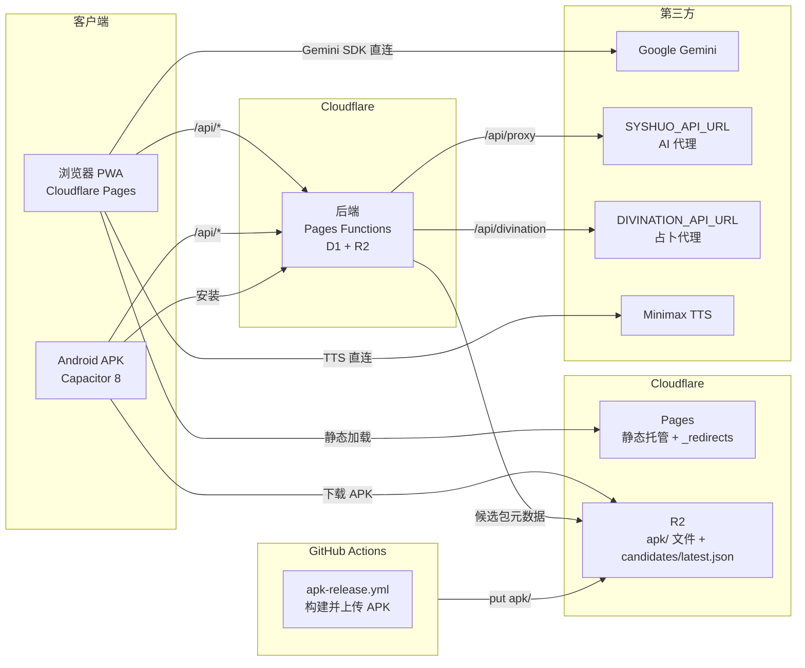
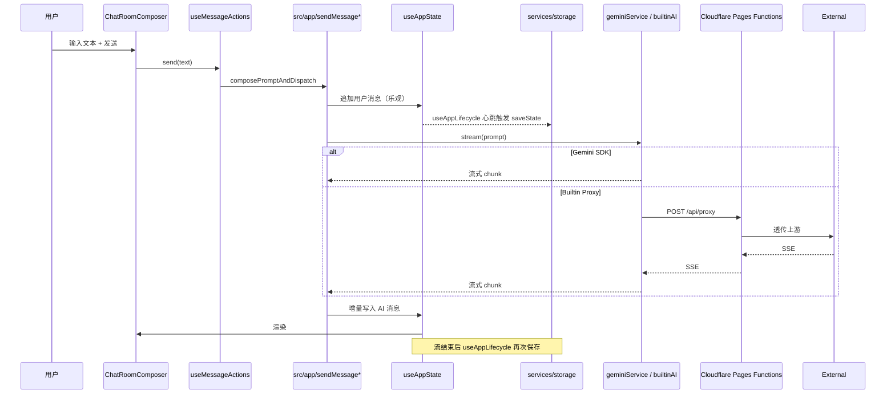
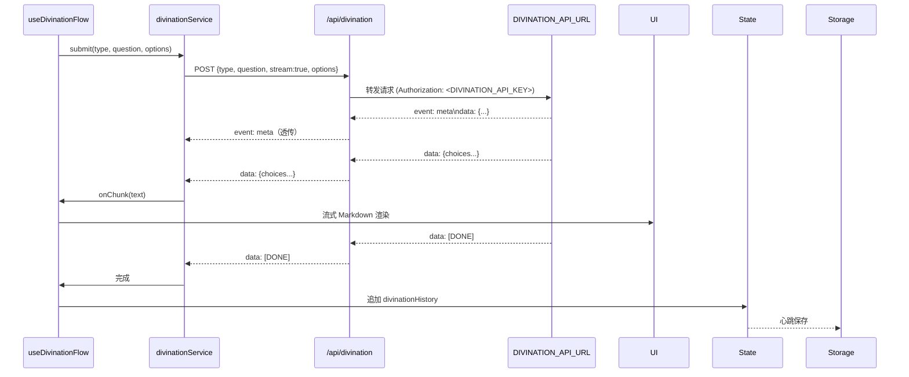
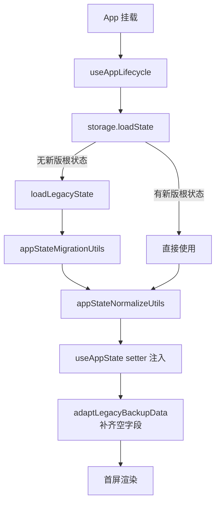
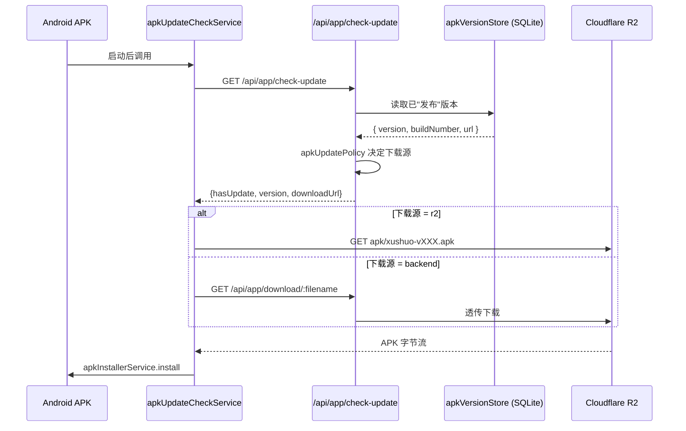
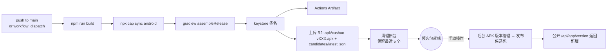
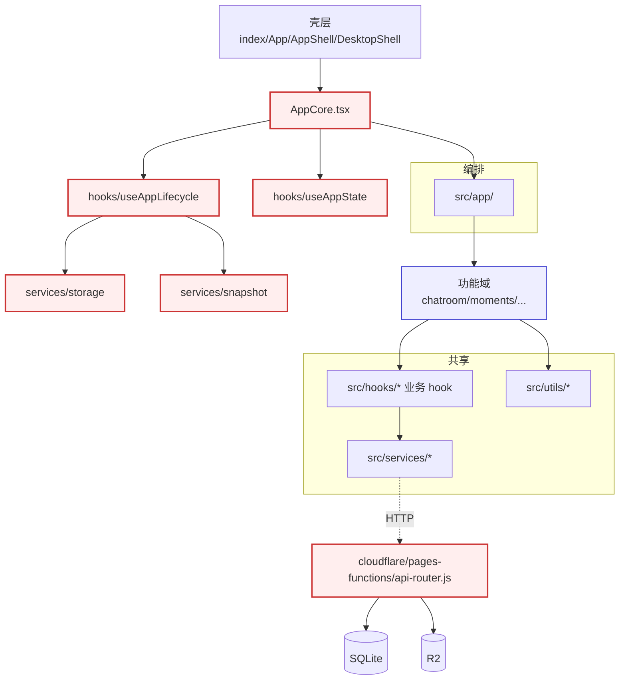
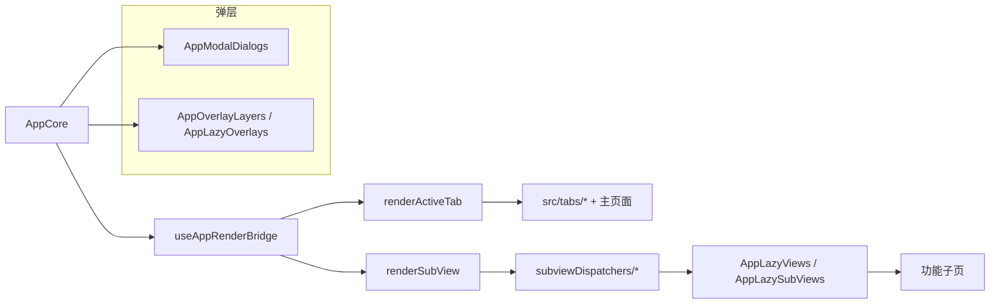
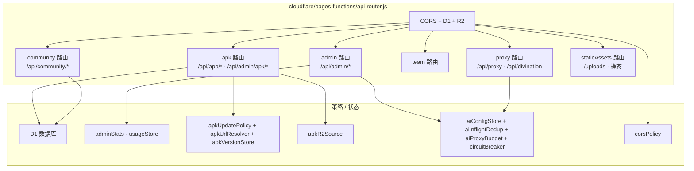
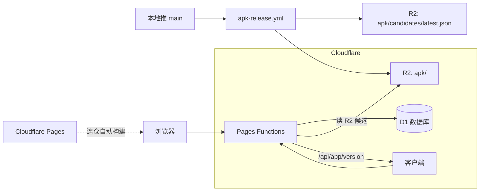

# 系统架构总览

这份文档讲清楚"叙说·春信"作为一个完整的产品在线时各组件如何配合：前端 / 后端 / 第三方 / 移动端 / 对象存储 / 镜像仓。看完这份再去读 [`project-map.md`](project-map.md) 了解前端代码层次会更顺。

## 1. 一张图看完整个产品

要点：

- **前端 / 后端统一 Cloudflare**：前端走 Cloudflare Pages，后端走 Pages Functions + D1 + R2，同域 `/api` 接线。
- **APK 和 R2 解耦**：GitHub Actions 只负责构建并把 APK 和 `candidates/latest.json` 放进 R2，后端只读这份候选元数据，**最终对用户生效需要后台手动发布**。
- **Gemini 直连**：用户用自己的 API Key，前端走官方 SDK，不经过后端，避免代理流量与额度成本。
- **占卜走后端代理**：因为占卜接口需要保护 Key，并且要转发 SSE 流。

## 2. 关键数据流

### 2.1 一次普通聊天发送

### 2.2 一次占卜请求（SSE）

### 2.3 启动恢复

详见 [`state-and-persistence.md`](state-and-persistence.md) §3。

### 2.4 APK 自动更新

详见 [`mobile-compat.md`](mobile-compat.md) 和 [`pages-functions-deploy.md`](pages-functions-deploy.md)。

### 2.5 APK 发布流水线（GitHub Actions）

- 候选 ≠ 已发布。CI 跑完只代表 R2 上有新文件。
- 后台 `APK 版本管理` 页才决定客户端是否能看到这个版本。
- 设计目的：避免 CI 一跑就把没经过验证的版本推送给所有用户。

## 3. 模块边界

红色框是 [`project-map.md`](project-map.md) §11 列出的中枢文件。修改边界：

- 功能域内部 → 自由改。
- 共享层（`hooks` / `services` / `utils`）→ 兼容旧调用，必要时加迁移。
- 编排层（`src/app/`）→ 注意 lazy/runtime 切片。
- 中枢 → 必须说明影响链路、补回归测试。

## 4. 渲染管线

- **主 Tab**：`renderActiveTab.tsx` + `mainTabRenderParams.ts`。
- **子页面**：`renderSubView.tsx` + `subviewDispatchers/` + `subviewRenderParams/`，按 Tab/上下文动态分派。
- **重型视图**：通过 `AppLazyViews`/`AppLazySubViews`/`AppLazyOverlays` 拆 chunk，首屏只加载壳。
- **弹层**：模态/遮罩独立挂载，避免被 Tab 切换销毁。

> Vite 配置见 `vite.config.ts`，`manualChunks` 中按 `id.includes('/render-')`、`/genai`、`/sql.js` 拆 chunk，避免 SDK 把首屏拖慢。

## 5. 后端架构

- 后端运行在 **Cloudflare Pages Functions**，D1 承载数据库，R2 承载文件存储。

## 6. AI 与代理

### 6.1 模式对比

| 模式 | 路径 | 何时用 | 注意 |
| --- | --- | --- | --- |
| Gemini 直连 | 浏览器 → Google | 用户提供自己的 Gemini API Key | 流量 / 额度由用户承担；`@google/genai` 走 SDK |
| 内置代理（builtinAI） | 浏览器 → `/api/proxy` → SYSHUO | 用户没有 Key、走平台额度 | 后端有 `aiProxyBudget`、`circuitBreaker`、`aiInflightDedup` 三层保护 |
| 占卜代理 | 浏览器 → `/api/divination` → DIVINATION | 占卜功能 | SSE 透传，含 `meta` 事件 |
| TTS | 浏览器 → Minimax | 语音合成 | 由前端直连 |

### 6.2 限流与去重

`cloudflare/pages-functions/proxy-budget.js`：相同请求在同一时刻只发一份到上游，避免重复扣费；每客户端配额、滑动窗口、IP/UA 维度；上游失败连续超过阈值时进入熔断，自动恢复。
`cloudflare/pages-functions/state.js`：使用量持久化，供后台统计展示。

> AI 上下文体积监控在前端：`src/services/aiContextAssetStats.ts` + `aiContextWarning.ts`。

## 7. 部署关键路径

- 前端无需镜像，直连 Cloudflare Pages 自动构建。
- 后端运行在 Cloudflare Pages Functions，D1 承载数据，R2 承载文件存储。

## 8. 端口、域名、环境变量速查

| 角色 | 默认值 | 来源 |
| --- | --- | --- |
| 前端 dev 端口 | 8003 | `vite.config.ts` |
| `VITE_SERVER_URL` | （可选） | 前端环境变量；浏览器留空时走同域 `/api`，APK 默认回落 `https://xushuo.cc` |
| `SYSHUO_API_URL` | （必填） | Cloudflare Pages Functions 环境变量 |
| `DIVINATION_API_URL` | `https://sydf.cc/api/v1/divination` | Cloudflare Pages Functions 环境变量 |
| `ALLOWED_ORIGINS` | （必填） | Cloudflare Pages Functions CORS，前端域名列表 |
| `ADMIN_KEY` | （必填，**生产必须自定义**） | Cloudflare Pages Functions 后台口令 |
| `APK_SOURCE` | `r2` | 候选 APK 数据源 |
| `APK_R2_PUBLIC_BASE_URL` | `https://r2.xushuo.cc` | 客户端下载 APK 的公网地址 |
| Capacitor `appId` | `com.xushuo.lk` | `capacitor.config.ts` |
| IndexedDB 数据库名 | `XushuoDB` v16 | `src/services/storage.ts` |

详细变量含义见 [`pages-functions-deploy.md`](pages-functions-deploy.md) 与 README §环境变量。

## 9. 安全与边界

- **`ADMIN_KEY` 必须改默认值**。后台所有写操作都要它。
- **Gemini Key 不经过后端**。前端 IndexedDB 持久化，后端永远不知道。
- **占卜 Key 不下发前端**。`DIVINATION_API_KEY` 只在后端读取，前端只能调 `/api/divination`。
- **CORS 严格白名单**：`ALLOWED_ORIGINS` 只放前端页面域名，**不包括后端 API 域名本身**。
- **APK 候选 vs 已发布**：双层闸门，CI 出包不会自动推送。
- **健康检查**：`GET /health` 不依赖 DB。
- **崩溃日志**：由 Cloudflare Pages Functions 运行时自动处理，无需手动维护。

## 10. 延伸阅读

- 持久化与四条数据链 → [`state-and-persistence.md`](state-and-persistence.md)
- 移动端兼容、Capacitor、安全区 → [`mobile-compat.md`](mobile-compat.md)
- 皮肤与 render-engine → [`skin-system.md`](skin-system.md)
- 开发者占卜 API → [`api.md`](api.md)
- 部署与运维 → [`pages-functions-deploy.md`](pages-functions-deploy.md)
- 长期治理 → [`audit-plan.md`](audit-plan.md)
- 协作守则 → [`agents.md`](agents.md)
- 前端代码地图 → [`project-map.md`](project-map.md)
