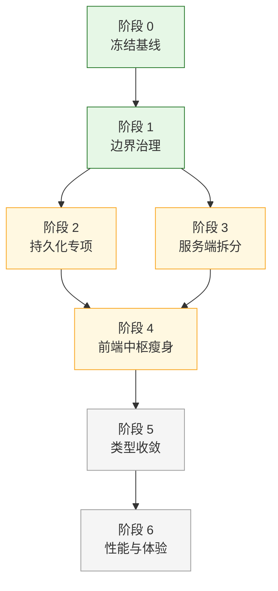
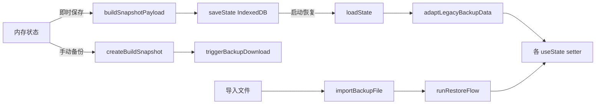
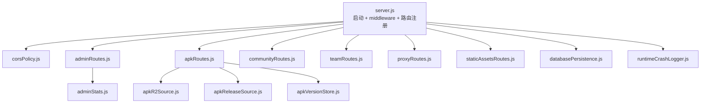
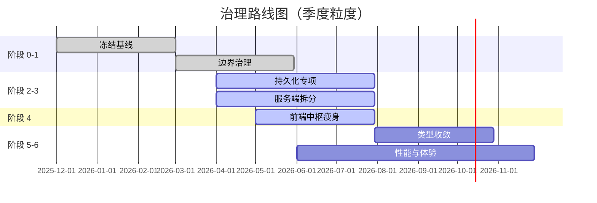

# 治理路线图

> **注意**：本地 `server/`（Express + SQLite）后端已移除，当前全部能力由 Cloudflare Pages Functions + D1 + R2 承载。以下文档中关于 `server/` 的拆分/治理记录保留为历史参考。

这份文档记录"叙说·春信"长期治理路线：边界整理、持久化收敛、服务端拆分、前端瘦身、类型迁移、性能。

它是**活文档**：每个阶段完成一部分都在这里勾选 / 注记进展，遇到新风险就加进 §10 风险登记表。

> 配套阅读：[`project-map.md`](project-map.md)（代码地图）、[`state-and-persistence.md`](state-and-persistence.md)（持久化）、[`agents.md`](agents.md)（协作规则）。

## 0. 路线总览



依赖关系：

- 0 / 1 是所有后续阶段的前提。
- 2（持久化）仍是当前主线；3（服务端）已随旧 Express 后端移除而归档，仅保留历史记录。
- 4（前端中枢瘦身）需要 2 完成，因为持久化字段稳定后才能放心拆 hook。
- 5（类型）和 6（性能）放最后是因为它们是"持续工作"，不会有终态。

## 1. 当前基线

### 1.1 验证命令

```bash
npm run typecheck          # tsc --noEmit
npm test                   # 全部 tests/*.test.ts，数量由 scripts/run-tests.js 动态统计
npm run build              # 生产构建到 dist/
npm run verify             # = typecheck + test + build（提交前推荐）
```

### 1.2 仓库体量（2026-05 快照）

| 维度 | 数值 |
| --- | --- |
| 测试文件 | 运行时动态统计（见 `npm test` 输出） |
| `src/AppCore.tsx` | 263 行 |
| `src/hooks/useAppState.ts` | 368 行 |
| `src/hooks/useAppLifecycle.ts` | 294 行 |
| `src/services/storage.ts` | 200 行 |
| `src/services/snapshot/snapshotBuilder.ts` | 195 行 |
| `src/app/` | ~50 个 flow / handler / loader 文件 |
| 内置皮肤 | 12 套 |
| 测试覆盖：持久化字段 | 4 类回归（缺失、空数组、空对象、迁移） |

### 1.3 已完成的治理动作

- ✅ 仓库结构整理：所有前端源代码搬到 `src/`（2026-05）；`gx.js` 搬到 `scripts/`；部署文档收敛到 Cloudflare Pages + Functions。
- ✅ 文档体系重构（2026-05）：6 份文档全面扩写 + 新增 `architecture.md` / `state-and-persistence.md` / `mobile-compat.md` / `skin-system.md`，含 mermaid 架构图。
- ✅ Snapshot / Restore 抽离：`src/services/snapshot/snapshotBuilder.ts`、`src/app/restoreFlow.ts` 已独立。
- ✅ APK 自更新拆服务：`apkUpdateCheckService.ts` / `apkUpdateInstallService.ts` 已分离，`apkUpdateService.ts` 仅做聚合再导出（保稳定 API）。
- ✅ Capacitor 8 升级 + 安全区 + 键盘兼容（`nativeSafeAreaCompat.ts` / `androidKeyboardCompat.ts`）。
- ✅ 12 套皮肤的 render-engine + 19 个高级覆盖 + DIY 主题导入导出。

## 2. 阶段 0：冻结基线（已完成）

### 2.1 目标

让所有协作者（人 + AI）使用同一套验证命令、同一个目录结构基线，避免每次改动还在讨论"在哪改"。

### 2.2 验收标准

- [x] `npm run verify` 一键跑完类型 + 测试 + 构建
- [x] `docs/project-map.md` 标识所有功能域和中枢文件
- [x] `docs/agents.md` 列出协作守则（含 16 条 AI 协作规则）
- [x] Cloudflare Pages 提供 PR 构建检查；GitHub Actions 保留 APK release（`push main` / 手动触发）

### 2.3 产出

- `docs/project-map.md`、`docs/agents.md`、`docs/state-and-persistence.md` 等成体系文档。
- 仓库根整洁化（前端代码全在 `src/` 下）。

## 3. 阶段 1：边界治理（已完成）

### 3.1 目标

让 `AppCore.tsx`、`useAppState.ts` 不再做"功能域专属逻辑"，把功能下沉到对应的目录。

### 3.2 验收标准

- [x] AppCore 已拆出 `app/` 目录的 flow / handler / loader（~50 文件）
- [x] AppShell / DesktopModeShell / 桌面模式 / 浏览器壳分离
- [x] 公共组件 `Common.tsx` / `CommonCollapsible.tsx` 不引用任何功能域
- [x] `app/AppLazyViews.ts` / `AppLazyOverlays.tsx` / `AppLazySubViews.tsx` 把功能页延迟加载切成独立 chunk
- [x] 默认搜索排除目录：`node_modules`、`dist`、`dev-dist`、`android/.gradle`、`android/app/build`、`dist/apk`

### 3.3 风险

- 功能域之间的 `import` 仍可能"邻居互相依赖"（`chatroom/` 引 `moments/` 等）。后续按需拉直。

## 4. 阶段 2：持久化专项（进行中）

### 4.1 目标

让 4 条数据链都对齐"4 类回归测试 + 5 步检查清单"，新增字段不再出现"一刷新就丢"或"导入后默认数据被覆盖"。

### 4.2 4 条数据链



每条链的实现：

- 即时保存：`src/hooks/useAppLifecycle.ts` → `src/services/snapshot/snapshotBuilder.ts` → `src/services/storage.ts`
- 启动恢复：`storage.ts loadState` → `app/restoreFlow.ts` → `useAppState` setters
- 手动备份：`app/backupFlow.ts` → `src/utils/backupExport.ts`
- 导入恢复：`app/importBackupFile.ts` → `app/restoreFlow.ts`

### 4.3 验收标准

- [x] `SnapshotInput` / `SnapshotPayload` 类型与 `buildSnapshotPayload` 默认值同步
- [x] 4 类回归测试模板存在（`tests/snapshotPayloadContract.test.ts` 等）
- [ ] 所有持久化字段都有对应 `tests/<name>Persistence.test.ts`
- [ ] `adaptLegacyBackupData` 处理所有空 / 缺失场景，覆盖在 `tests/legacy*.test.ts`
- [ ] 文档 `state-and-persistence.md` §"已知字段"实时维护
- [ ] CI 失败信号：缺失任意一类回归测试

### 4.4 进展（2026-05）

| 字段 | 即时保存 | 启动恢复 | 4 类回归 | 备份导入 |
| --- | --- | --- | --- | --- |
| chats | ✅ | ✅ | ✅ | ✅ |
| contacts | ✅ | ✅ | ✅ | ✅ |
| moments | ✅ | ✅ | ✅ | ✅ |
| settings (含 12 皮肤 + 19 覆盖) | ✅ | ✅ | ✅ | ✅ |
| communityCache | ✅ | ✅ | ⚠️ 部分 | ✅ |
| customStickers | ✅ | ✅ | ✅ | ✅ |
| forumCache | ✅ | ✅ | ⚠️ 部分 | ✅ |
| musicCache | ✅ | ✅ | ⚠️ 部分 | ✅ |
| customEmojis (window 临时态) | ❌ | ❌ | n/a | n/a |

> ⚠️ 标"部分"的字段表示"键存在但空"场景没覆盖完整，需要补测试。
> ❌ `customEmojis` 当前在 `window.__customEmojis` 内存挂着不进 IndexedDB，是已知缺陷（见 §10 风险表 R-01）。

### 4.5 待办

- [ ] 补全 `community / forum / music` 三个域的 4 类回归测试
- [ ] 修复 `customEmojis` 持久化（迁移到 IndexedDB；不能再用 window 全局）
- [ ] 文档化 `state-and-persistence.md` §"已知字段"动态表

## 5. 阶段 3：服务端拆分（历史归档）

> 本节保留旧 Express 后端拆分记录，不代表当前待办；当前后端入口见 `cloudflare/pages-functions/api-router.js`，部署说明见 [`pages-functions-deploy.md`](pages-functions-deploy.md)。

### 5.1 目标

~~把 `server/server.js`（825 行）按域拆开~~（server 后端已移除，全部能力迁移到 Cloudflare Pages Functions）。

### 5.2 拆分计划



### 5.3 验收标准

- [x] `corsPolicy.js` 独立
- [x] `apkRoutes.js` 已抽出（含候选包、下载、版本管理）
- [x] `apkR2Source.js` / `apkReleaseSource.js` / `apkVersionStore.js` 数据源层抽出
- [x] `communityRoutes.js`、`teamRoutes.js`、`adminRoutes.js`、`proxyRoutes.js`、`staticAssetsRoutes.js` 已抽出
- [x] `databasePersistence.js` / `databaseSchema.js` 独立
- [x] `circuitBreaker.js` / `aiInflightDedup.js` / `aiProxyBudget.js` AI 代理保护层
- 不适用：`server.js` < 400 行（旧 Express 后端已移除）
- 不适用：启动日志统一收口到 `runtimeCrashLogger.js`（旧 Express 后端已移除）
- 不适用：所有路由的单元测试覆盖业务码 + 错误处理（旧 Express 后端已移除）

### 5.4 进展

以下为旧 Express 后端迁移前状态，已不再作为当前拆分顺序。服务端当时已经走过最难的一步——核心路由都抽出了独立文件。当前 `server.js` 残留主要是：

- HTTP 服务器启动 / 端口监听
- middleware 注册（CORS、JSON、admin auth）
- 路由挂载
- 上游 AI 代理 fetch 实现细节（200 行+）

剩余拆分顺序（按优先级）：

1. AI 代理实现细节 → `aiProxyService.js`（独立模块）
2. middleware 链 → `serverMiddleware.js`
3. 启动序列 → `httpServerStart.js` 已存在但只覆盖了一部分

### 5.5 风险

- `server.js` 改动会同时影响所有 routes，必须逐步重构 + 跑测试
- 上游 AI 代理的流式响应处理（SSE 转发）逻辑复杂，拆出时要带回归测试

## 6. 阶段 4：前端中枢瘦身（进行中）

### 6.1 目标

把 `AppCore.tsx`、`useAppState.ts`、`useAppLifecycle.ts` 的功能下沉到 `app/` 目录的 flow / handler / loader 中。

### 6.2 已完成的拆分

- ✅ `chatRoomActionFlow.ts` — 聊天动作链路
- ✅ `contactActionFlow.ts` — 联系人动作
- ✅ `momentActionFlow.ts` — 朋友圈动作
- ✅ `restoreFlow.ts` — 启动恢复
- ✅ `backupFlow.ts` — 手动备份
- ✅ `clearDataFlow.ts` — 数据清理
- ✅ `anonymousSessionFlow.ts` — 匿名聊天会话
- ✅ `chatReplySuggestionFlow.ts` — AI 回复建议
- ✅ `dataMaintenanceActionHandlers.ts` — 数据维护
- ✅ `chatActionHandlers.ts` / `chatSceneActionHandlers.ts` — 动作分发
- ✅ `AppOverlayLayers.tsx` — 全局浮层桥接
- ✅ Lazy 切片：`AppLazyViews` / `AppLazyOverlays` / `AppLazySubViews`

### 6.3 剩余拆分

- [ ] **占卜提交和历史记录**：当前 `useAppState` 里仍有占卜 in-flight 状态，应抽到 `divinationFlow.ts`
- [ ] **APK / PWA 更新弹窗**：`useAppUpdate` + `useApkUpdateDismiss` 已存在，但触发逻辑还在 `AppCore`，应进一步收敛
- [ ] **聊天上下文风险提醒**：`aiContextWarning.ts` 服务已有，但接线在 `AppCore` 里
- [ ] **桌面模式快捷键**：当前散在 `DesktopSystemNavigation`，应集中

### 6.4 验收标准

- [ ] `AppCore.tsx` < 200 行（当前 263）
- [ ] `useAppState.ts` < 300 行（当前 368）
- [ ] `useAppLifecycle.ts` < 250 行（当前 294）
- [ ] 所有 flow 都在 `app/` 目录，命名一致 `<domain>Flow.ts`
- [ ] flow 有对应单测 `tests/<domain>FlowBoundary.test.ts`

### 6.5 拆分原则

- **保留行为和视觉**，不借机重设产品逻辑
- 一次拆一个 flow，配套加 boundary test
- 拆完 import 链路必须保持向后兼容（不破坏 lazy chunk 切分）

## 7. 阶段 5：类型收敛（待开始）

### 7.1 目标

让外部输入（IndexedDB 读取、JSON 导入、AI 接口响应）严格走"`unknown` 入口 + 显式 normalize"，逐步消灭散落的 `any`。

### 7.2 当前问题

- `tsconfig.json` 没开 `strict`（开了会有 ~1000+ 错误）
- 部分历史模块用 `any` 接外部数据，导致类型错乱不报警
- AI 响应类型不严格，`response.data?.choices?.[0]?.message?.content as any` 散布各处

### 7.3 验收标准

- [ ] 新增持久化字段必须进入 `SnapshotInput` / `SnapshotPayload`，不允许 `any`
- [ ] 外部 JSON 入口（导入文件、AI 响应、第三方 API）必须先走 `unknown` + 校验
- [ ] `tests/snapshotPayloadContract.test.ts` 覆盖所有顶层字段类型
- [ ] 高风险模块逐步开启 `strict`：先 `services/`，再 `app/`，最后 `hooks/`
- [ ] 不一次性开启 `strict: true`，避免大爆炸

### 7.4 推进策略

| 步骤 | 范围 | 风险 |
| --- | --- | --- |
| 1 | `src/services/snapshot/`、`src/services/storage.ts` | 低（已有契约测试） |
| 2 | `src/services/divinationService.ts`、`src/services/geminiService.ts` | 中（外部 API） |
| 3 | `src/app/restoreFlow.ts` 等 flow | 中 |
| 4 | `src/hooks/` | 高（影响 AppCore） |
| 5 | 全局开 `strict: true` | 高（最后做） |

每个步骤独立 PR，跑 `npm run verify` 通过。

## 8. 阶段 6：性能与体验（持续）

### 8.1 目标

让首屏 < 2 秒、流式响应有视觉反馈、移动端流畅。

### 8.2 当前痛点

- 启动后空白 1–2 秒：`genai`、`sql.js`、`AppCore` 三个 chunk 较大
- 桌面模式切回移动模式偶发抖动
- 移动端键盘抬起若网络慢，可能输入法和 footer 重叠 100ms

### 8.3 优化方向

- [ ] **Chunk 优化**：检查 `vite.config.ts` 的 `manualChunks`
  - [ ] `genai`（Google GenAI SDK）：是否能延迟到首次 AI 调用
  - [ ] `sql.js`：仅占卜历史用到，能不能 lazy
  - [ ] `AppCore`：拆下去后 chunk 应自动缩
- [ ] **重型设置页**：12 个皮肤 preview + 169 个图标 → IconTab 已 lazy，PresetTab 也做
- [ ] **真机验证清单**（见 [`mobile-compat.md`](mobile-compat.md) §11）每次中枢改动跑一遍
- [ ] **流式视觉反馈**：占卜 / AI 聊天的 loading 状态、光标、进度
- [ ] **桌面模式**：切换不重置导航栈
- [ ] **备份恢复**：5MB+ 文件导入时显示进度

### 8.4 验收标准

- [ ] 首屏 LCP（Largest Contentful Paint）< 2s on 4G
- [ ] AI 回复流式输出有可见光标 + token 计数
- [ ] 备份文件导入有进度条
- [ ] 真机测试 8 项 checklist 全过

## 9. 进度跟踪



> 上面甘特仅做时间感知，不是合同。每次推进同步 §1.3 和 §10。

## 10. 风险登记表

| ID | 描述 | 影响 | 缓解 | 状态 |
| --- | --- | --- | --- | --- |
| R-01 | `customEmojis` 不持久化（仅 window 内存） | 用户清缓存或换设备会丢自定义表情 | 迁移到 IndexedDB，加 4 类回归测试 | 待修 |
| R-02 | ~~`server.js` 仍 825 行~~（server 后端已移除，迁移到 Cloudflare Functions） | — | — | 已完成 |
| R-03 | ~~`server/data` SQLite 单点~~（已迁移到 Cloudflare D1） | — | — | 已解决 |
| R-04 | APK keystore 丢失=用户必须卸载重装 | 严重 | 至少 3 份冗余备份；GitHub Secret + 加密云盘 + 本地 | 已缓解 |
| R-05 | `tsconfig` 没开 strict | 类型错误漏检 | 阶段 5 逐步开启 | 计划中 |
| R-06 | `useAppLifecycle` 持久化字段漏一边（保存或恢复）就出 bug | 高频踩坑点 | 文档强化 + 4 类回归测试 + agents.md §9.9 | 已缓解 |
| R-07 | CapacitorHttp 启用后 SSE 在部分 Android 设备断流 | 占卜/AI 在某些 ROM 不可用 | 后端提供 ndjson 兜底；`mobile-compat.md` §3 文档化 | 缓解中 |
| R-08 | `ALLOWED_ORIGINS` 配错 | 跨域 403 | `pages-functions-deploy.md` §3.4 反复强调；后台错误日志收口 | 已缓解 |
| R-09 | `ADMIN_KEY` 默认值未改 | 后台被任何人访问 | `pages-functions-deploy.md` 警告；建议生产 healthcheck 同步检查 | 已缓解 |
| R-10 | 12 套皮肤覆盖不全的角落组件 | 切到 Noir / Y2K 视觉穿帮 | `tests/legacyUiPrimitiveUsage.test.ts` 守住部分；新组件强制变体接口 | 缓解中 |

## 11. 反治理（不做的事）

为了避免 scope creep，下列事项**短期内不做**：

| 项 | 不做的理由 |
| --- | --- |
| 切到 monorepo（pnpm workspace / turbo） | 当前 `src/` + `cloudflare/` 不需要复杂工具链；切了反而增加协作成本 |
| 替换 SQLite 为 PostgreSQL | DAU 没到瓶颈；改后所有 routes 都要重写 |
| 引入 Redux / Zustand 替换 useReducer | 当前架构稳定，迁移成本 > 收益 |
| 全量 TypeScript strict | R-05 列出，分阶段做 |
| 引入 React Query / SWR | 现有 service 模式工作良好；引入会带来额外学习成本 |
| 服务端引入 ORM（Prisma / Drizzle） | SQLite + raw SQL 当前可控；ORM 适合 schema 复杂场景 |
| 把前端打包改 webpack/turbopack | Vite 已经满足需求；切换收益不明显 |
| 引入 storybook | 12 套皮肤的视觉测试已用快照测试覆盖；storybook 维护成本高 |

如果有人提议做以上任一项，先在这里记录"为什么这次例外"。

## 12. 升级触发条件

下列条件之一满足时，把对应"反治理"项重新评估：

- DAU > 10k 且 SQLite 出现写入瓶颈 → 重评 PostgreSQL 迁移
- 移动端 + Web + 桌面真的需要差异化 service worker → 重评 monorepo
- 类型相关 bug 在 issue 列表占比 > 20% → 加速类型收敛
- AI SDK 切换（如新增 Claude / DeepSeek）+ 现有适配层难维护 → 重评 service 抽象

## 13. 阶段间协作约定

- **同一 PR 不混合阶段**：不要在持久化字段 PR 里顺手改 Cloudflare Functions 或历史服务端记录
- **跨阶段依赖记录在这里**：例如"阶段 4 拆 useAppLifecycle 必须等阶段 2 字段冻结"
- **每个阶段完成后回写本文件**：在 §1.3 加一条"已完成"，在 §10 风险表更新状态

---

阶段进度的具体落地参见各文档：

- 持久化：[`state-and-persistence.md`](state-and-persistence.md)
- 模块边界：[`project-map.md`](project-map.md)
- 协作规则：[`agents.md`](agents.md)
