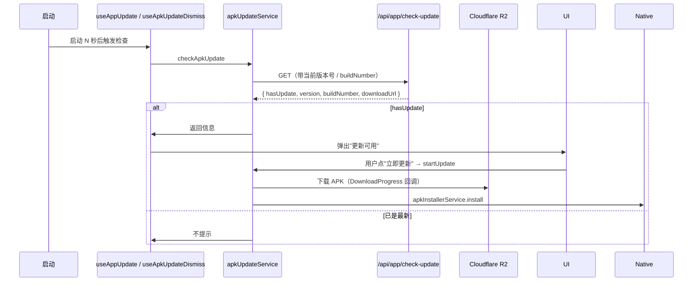

# 移动端与原生兼容

这份文档讲清楚 Web、PWA、Android Capacitor 三种容器下"叙说·春信"如何识别环境、处理键盘 / 安全区 / 返回键 / 自更新。

> 配套阅读：[`architecture.md`](architecture.md) §2.4（APK 自更新流程）、[`pages-functions-deploy.md`](pages-functions-deploy.md) §8（Cloudflare APK 分发差异）、[`README.md`](../README.md#apk-自动发布)（APK 自动发布与签名）、[`project-map.md`](project-map.md) §8。

## 1. 三种容器形态

| 形态 | 特征 | 关键判断 |
| --- | --- | --- |
| **Web 浏览器** | 直接访问 Cloudflare Pages 域名 | `!isNative.value` |
| **PWA** | 浏览器"添加到主屏幕" | `display-mode: standalone` |
| **Android APK** | Capacitor 8 包装 | `Capacitor.isNativePlatform()` 为 true，`Capacitor.getPlatform() === 'android'` |
| **iOS** | 当前**未编译 ipa**，仅作为 PWA 形态出现 | 不走 `@capacitor/ios` 路径 |

实现入口 `src/services/nativeService.ts`：

```ts
export const isNative = { get value() { return Capacitor.isNativePlatform(); } };
export const isAndroid = { get value() { return Capacitor.getPlatform() === 'android'; } };
export const isIOS = { get value() { return Capacitor.getPlatform() === 'ios'; } };
```

> **不要在 import 顶部直接读 `isNative.value`**——Capacitor 在某些 webview 启动时序中初始化较晚。永远在事件 / 组件 mount 后读。

## 2. Capacitor 配置

```ts
// capacitor.config.ts
{
  appId: 'com.xushuo.lk',
  appName: '叙说·春信',
  webDir: 'dist',
  server: {
    androidScheme: 'https',
    allowNavigation: ['*']
  },
  plugins: {
    CapacitorHttp: { enabled: true }
  },
  android: {
    backgroundColor: '#00000000',
    allowMixedContent: true
  }
}
```

要点：

- `androidScheme: 'https'` — APK 内的 webview 使用 https:// 协议，与浏览器一致，`window.location.protocol` 不会出现 `capacitor:` 等怪异 scheme。
- `allowNavigation: ['*']` — 允许 webview 内导航到任意域；这是因为前端会跨域访问 Pages 域、后端 API 域、R2 下载域。生产环境如需收紧应在 `ALLOWED_ORIGINS` 与 `corsPolicy.js` 双向校验。
- `CapacitorHttp.enabled: true` — `fetch` 自动走 native HTTP 通道（绕过 webview CORS），但**只对部分 endpoint 启用**，详见 §3。
- `allowMixedContent: true` — 兼容历史 http 链接（图片）。
- `backgroundColor: '#00000000'` — 透明背景，让前端皮肤决定背景色。

## 3. CapacitorHttp vs fetch

启用了 `CapacitorHttp` 后，**所有 `fetch(...)` 调用会被 patch 为 native 请求**，绕过 webview 的 CORS / cookie 限制。

带来的副作用：

- SSE 在 native HTTP 通道下表现不一致（部分平台不支持流式响应）。
- Cookie 默认不会自动跨请求保留。

应对：

- **占卜 SSE 路径** `divinationService.ts` 内部走 `fetch + ReadableStream`。在 native 下需要确认 chunked 转发正常；如有问题，路由到后端 `Content-Type: application/x-ndjson` 兜底版本。
- 大部分普通 JSON API 走 `httpService.ts` 封装，不依赖 cookie。
- Gemini SDK 直连：`@google/genai` 自己处理流式，目前 native 下亦正常。

## 4. 键盘兼容

```mermaid
flowchart TB
  Cap[Capacitor Keyboard 插件] --> Show[keyboardWillShow / keyboardDidShow]
  Show --> Compat[androidKeyboardCompat]
  Compat --> Layout[isKeyboardLayoutVisible<br/>(>= 100px 才算可见)]
  Layout --> Bot[resolveKeyboardOffsetBottom<br/>计算需要抬起的距离]
  Bot --> CSS[CSS 变量 / inline style]
  CSS --> UI[ChatRoomComposer / Compose 输入框]
```

实现位置：

- `src/services/nativeService.ts` — `onKeyboardShow` / `onKeyboardHide`，桥接 `@capacitor/keyboard`。
- `src/services/androidKeyboardCompat.ts`：
  - `KEYBOARD_VISIBLE_THRESHOLD_PX = 100` — 低于这个高度认定为虚假触发（手势条 / 软键盘抖动）。
  - `isKeyboardLayoutVisible(height)` — 布尔判断。
  - `resolveKeyboardLayoutState({ height, isInputFocused, ... })` — 解出 layout 状态。
  - `resolveKeyboardOffsetBottom({ height, safeAreaBottom })` — 真正用来挤压底部 padding 的偏移量。
- `src/utils/chat/...` — 聊天室底部 footer 引用上述偏移。

> 历史 Bug：Android 上输入框被键盘遮住，是因为某些 ROM 上 `keyboardHeight=0/24/40` 等非零小值会被误认为"键盘出现"。引入 `THRESHOLD_PX = 100` 后解决。**改这个常量需要回归 `tests/androidKeyboardCompat.test.ts` 与 `tests/androidChatFooterSafeBottom.test.ts`**。

## 5. 安全区（SafeArea）

```mermaid
flowchart LR
  iOSPWA[iOS PWA<br/>env-safe-area-inset-*] --> CSS1[CSS env() 变量]
  Android[Android Capacitor<br/>StatusBarPlugin] --> Native[nativeSafeAreaCompat]
  Native --> CSS2[--safe-area-inset-* 自定义变量]
  CSS1 --> Layout
  CSS2 --> Layout
  Layout[AppShell / DesktopShell / ChatRoom 布局]
```

关键文件 `src/services/nativeSafeAreaCompat.ts`：

- `resolveLegacyAndroidSafeAreaCompat(params)` — 计算需要写入的 `--safe-area-inset-top/right/bottom/left`。
- `applyLegacyAndroidSafeAreaCompat()` — 在启动时调用，用 `document.documentElement.style.setProperty(...)` 注入到 CSS 变量。
- 仅"旧版 Android（API 30 以下）+ Capacitor"路径需要这套兜底；新版 Android 13+ 由系统直接暴露 `env(safe-area-inset-*)`。

iOS PWA：浏览器原生支持 `env(safe-area-inset-*)`，**不需要这套补丁**。

## 6. 返回键

```ts
// src/services/nativeService.ts
export function onBackButton(callback: () => void): () => void;
```

接线方向：Android 硬件 / 手势返回 → Capacitor → `App` 插件 `backButton` → 前端 `onBackButton(callback)` → 回退导航栈（`useNavigationStack`）。

> **注意**：返回键如果回退到根 Tab 不应该退出 App，而应该呼出"再按一次退出"提示。当前在 `AppCore` / `useNavigationStack` 协同处理，**改返回键路径必须回归"在主 Tab 按返回不应退应用"用例**。

## 7. App 生命周期

```ts
// src/services/nativeService.ts
export function onAppStateChange(handler: (state: { isActive: boolean }) => void): () => void;
```

`@capacitor/app` 在 App 进入后台 / 回到前台时触发。实际用途：

- 进入后台：暂停心跳、关闭 SSE 连接，避免 Android 杀流。
- 回到前台：触发一次启动恢复 + 心跳（`useAppLifecycle`），更新 APK / PWA 状态。

## 8. APK 自更新



涉及文件：

- `src/services/apkUpdateTypes.ts` — `ApkUpdateInfo` / `DownloadProgress` / `StartUpdateResult`
- `src/services/apkUpdateCheckService.ts` — `checkApkUpdate` / `isAndroidPlatform` / `isNativeEnvironment`
- `src/services/apkUpdateInstallService.ts` — `formatFileSize` / `startUpdate`（下载 + 调起安装器）
- `src/services/apkUpdateService.ts` — 聚合再导出（保持稳定 API）
- `src/services/apkInstallerService.ts` — 真正调用原生 intent 安装
- `src/hooks/useAppUpdate.ts` — UI 触发与状态机
- `src/hooks/useApkUpdateDismiss.ts` — 用户"暂不更新"持久化逻辑
- 测试：`tests/apkUpdateInstallTypeBoundary.test.ts`、`tests/apkUpdateDismissHookExtraction.test.ts`、`tests/apkUpdatePolicy.test.ts`

> **候选包 ≠ 已发布**：CI 上传 R2 不会自动推用户。后台 `APK 版本管理` 点"发布候选包"后，`/api/app/version` 才会返回这个版本，客户端才能感知。详见 [`README.md`](../README.md#apk-自动发布) 与 [`pages-functions-deploy.md`](pages-functions-deploy.md) §8。

## 9. 桌面模式（Desktop Mode）

桌面模式不是 Electron / Tauri，是同一份前端代码在大屏 / 横屏下切到 `DesktopModeShell`。判断：

- `useAppState` 中 `isDesktopMode` 标志（用户在设置中开启 + 自动检测分辨率）。
- 触发 `DesktopModeShell` 替代 `AppShell`。

桌面模式专用：

- `src/DesktopSystemNavigation.tsx` + `desktopSystemNavigationConstants.ts`
- `src/shell/DesktopSidebarNav.tsx`
- `src/utils/desktopLockUtils.ts`、`desktopPageUtils.ts`
- `src/services/desktopSettingsTransfer.ts`（PC 配置传输）

## 10. PWA

`vite-plugin-pwa` 在 `vite.config.ts` 中启用：

- `manifest`：从 `public/manifest.json` 或插件配置读取，定义 App 名称、图标、`display: standalone`。
- Service Worker：`workbox` 风格预缓存，构建产物会列出 119 个 precache 条目。
- 离线策略：`dist/` 静态资源优先 cache，API 请求保持 network-only（避免缓存陈旧的用户数据）。

`public/_redirects` 给 Cloudflare Pages 用，把所有未命中静态文件的路径回退到 `index.html`，支持前端路由刷新。

## 11. 真机测试 checklist

每次合并涉及壳层 / 键盘 / 安全区 / 自更新的改动前，至少跑：

| 场景 | 预期 |
| --- | --- |
| Android 弹键盘 | 输入框抬起 ≥ keyboardHeight + safeBottom，不被遮 |
| Android 收键盘 | 底部恢复，不留空白 padding |
| Android 横屏切竖屏 | 安全区刷新，状态栏文字色不丢 |
| Android 长按返回 | 主 Tab 提示二次确认；子页正常返回栈 |
| iOS PWA 添加到主屏幕 | 顶部刘海不遮内容，底部手势条不顶按钮 |
| 弱网下载 APK | 进度回调可见，失败有重试入口 |
| APK 进入后台 5 分钟 | 回前台不丢失会话 / SSE 自动重连 |
| 桌面模式切回移动模式 | 状态保留，导航栈不重置 |

测试脚本（部分自动化）：

- `tests/androidKeyboardCompat.test.ts`、`tests/androidKeyboardLayoutScope.test.ts`
- `tests/androidChatFooterSafeBottom.test.ts`
- `tests/androidGradleRepositoryOrder.test.ts`（确保 Gradle 仓库顺序不被 capacitor 升级覆写）
- `tests/apkR2Source.test.ts`、`tests/apkReleaseSource.test.ts`、`tests/apkUpdatePolicy.test.ts`、`tests/apkUrlResolver.test.ts`、`tests/apkDownloadResolver.test.ts`

## 12. 常见问题

| 现象 | 排查方向 |
| --- | --- |
| Android 输入框被键盘遮挡 | `KEYBOARD_VISIBLE_THRESHOLD_PX`、ChatRoomComposer 的 `keyboardOffsetBottom` 接线 |
| iOS PWA 顶部 status bar 遮挡 | 检查 CSS `padding-top: env(safe-area-inset-top)` 是否被覆盖 |
| 启动后空白 1–2 秒 | 主线程 chunk 太大；查 `vite.config.ts` 的 `manualChunks`，是否有 SDK 没有切出去 |
| 自动更新弹窗不出现 | `/api/app/version` 是否已发布候选；`useApkUpdateDismiss` 是否记忆了"今天不再提示" |
| 安装 APK 时报 "解析包错误" | 签名 keystore 不一致或被 Android 14+ 拒绝；需要重新签 + 升 `compileSdk` |
| `cap sync` 后 Gradle 报奇怪错误 | 检查 `android/variables.gradle`、`android/build.gradle` 是否被 cap 覆写；`tests/androidGradleRepositoryOrder.test.ts` 锁仓库顺序 |
| 内置返回键直接退出 App | `useNavigationStack` 中"主 Tab 二次确认"逻辑没接好 |
| AI 流式输出在 Android 上断流 | 启用 `CapacitorHttp` 后部分代理无 chunked；改用 `fetch` 时显式声明 `responseType: 'stream'` 或后端切 ndjson |
