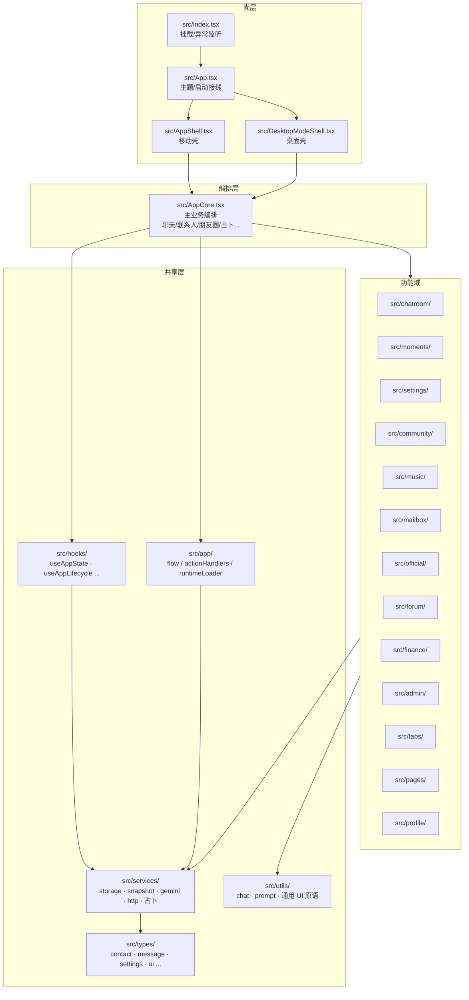
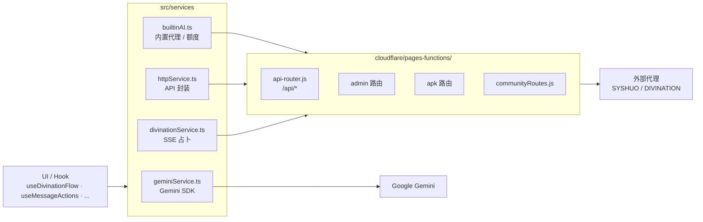
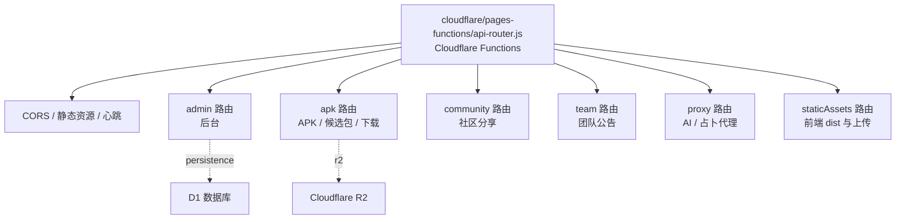

# 项目代码地图

这份地图用于多 AI / 多人协作时快速定位代码边界，避免因为一个局部功能误改中枢文件。新加入项目的人也建议先读这份再开工。

> 配套阅读：[`architecture.md`](architecture.md) 看跨进程总图、[`state-and-persistence.md`](state-and-persistence.md) 看四条数据链、[`agents.md`](agents.md) 看协作守则。

## 0. 总览

应用代码全部位于 `src/`，按"壳层 → 编排层 → 共享层 → 功能域 → 服务层 → 类型层"五层组织。后端由 `cloudflare/pages-functions/` 承载，`android/` 是 Capacitor 8 生成的原生工程，`tests/` 与 `scripts/` 在仓库根。

> 阅读图的方式：从上往下走是"用户从打开 App 到看到某个具体功能"的层次；任何一个功能域的修改默认应停在自己这一层 + 共享层，不该向上钻入编排层、壳层。

## 1. 入口与壳层

| 文件 | 角色 |
| --- | --- |
| `src/index.tsx` | React 挂载、全局异常监听、PWA 注册触发点 |
| `src/App.tsx` | 应用启动、主题、生命周期接线（`useAppLifecycle`） |
| `src/AppCore.tsx` | 主业务编排层，连接聊天、联系人、朋友圈、更新、占卜、匿名聊天、APK/PWA 弹窗等流程，是"功能 → UI"的总线 |
| `src/AppShell.tsx` | 移动壳：状态栏、底部导航、Tab 容器、对话系统 |
| `src/DesktopModeShell.tsx` | 桌面模式壳：左侧导航、桌面级外观 |
| `src/DesktopSystemNavigation.tsx` + `desktopSystemNavigationConstants.ts` | 桌面端系统级导航 |
| `index.html` | Vite 入口 HTML，引用 `/src/index.css` 与 `/src/index.tsx` |

> 这一层是"骨架"，**默认不要随便改**。改之前先问：能不能放在 `src/app/` 的 flow 里、或者具体功能域内部？

## 2. 状态、生命周期与持久化

> 这一段是中枢，详细机制见 [`state-and-persistence.md`](state-and-persistence.md)。

- `src/hooks/useAppState.ts`：全局状态定义（联系人、消息、朋友圈、用户、设置、AI 配置、世界书、占卜历史、匿名聊天、APK/PWA 状态…）和导航动作。**新增持久化字段第一站。**
- `src/hooks/useAppLifecycle.ts`：启动恢复、定时保存、心跳。
- `src/services/storage.ts`：IndexedDB（`XushuoDB` v16，`app_state` store，单 key `root`）根状态读写 + 旧版数据迁移。
- `src/services/snapshot/`：备份快照、ZIP 导入导出、图片引用替换。
  - `snapshotBuilder.ts`：`SnapshotInput` / `SnapshotPayload` 类型定义、`buildSnapshotPayload`。
  - `zipOperations.ts`：`exportAsZip` / `importFromZip` / `triggerBackupDownload` / `importBackupFile`。
  - `imageHandling.ts`：图片 base64 与文件引用互转。
  - `exportEncryption.ts`：混淆式“加密”导出（可选，非安全加密）。
- `src/app/restoreFlow.ts`：导入恢复主流程 `runRestoreFlow`。
- `src/app/dataMaintenanceActionHandlers.ts`、`dataMaintenanceHandlerRuntime.ts`：设置页里的备份、恢复、清理入口。

**新增持久化字段时必须同步修改的 5 个位置**：

1. `SnapshotInput` 类型（`src/services/snapshot/snapshotBuilder.ts`）
2. `SnapshotPayload` 类型 + `buildSnapshotPayload` 默认值
3. `useAppLifecycle.ts` 的保存路径 + 启动恢复路径
4. `createBuildSnapshot` / `adaptLegacyBackupData`（旧字段迁移）
5. 对应回归测试：覆盖 **键缺失 / 键存在但空数组 / 键存在但空对象 / 旧字段迁移** 四个场景，缺一不可（参见 `tests/snapshotBuilder*.test.ts`）

## 3. 编排层：`src/app/`

`src/app/` 是 `AppCore` 的延伸，按 flow / handler / runtime / lazy 四类组织。任何"接两端、跨多个域"的逻辑应该落在这里，而不是塞回 `AppCore.tsx`。

主要族群：

| 族群 | 代表文件 | 职责 |
| --- | --- | --- |
| 消息发送 | `sendMessage/`、`sendMessageFlow.ts`、`sendMessageRuntimeLoader.ts` | 发送、AI 回复、重发、上下文组装 |
| 聊天动作 | `chatActionHandlers.ts`、`chatRoomActionFlow.ts`、`chatMessageFlowUtils.ts`、`messageMenuFlow`（在 `chatroom/`） | 聊天页用户交互的总线 |
| 联系人 | `contactActionFlow.ts`、`contactCardCodec.ts`、`contactCardWatermark.ts`、`contactJsonImportUtils.ts`、`contactManagementActionHandlers.ts` | 联系人卡片、表单、导入/导出 |
| 朋友圈 | `momentActionFlow.ts`、`momentActionRuntime.ts`、`momentsActionHandlers.ts` | 朋友圈发布 / 点赞 / 评论 / 删除 |
| 公众号 | `officialArticleFlow.ts`、`officialArticleRuntime.ts`、`officialArticleAiUtils.ts` | 公众号文章生成与展示 |
| 邮箱 | `mailboxActionHandlers.ts`、`mailboxLetterUtils.ts`、`mailboxReplyRuntime.ts` | 写信、读信、AI 回信 |
| 个人中心 | `profileActionFlow.ts`、`profileSceneActionHandlers.ts`、`profileSceneRuntime.ts` | 个人主页、面具、人格 |
| 钱包 | `walletActionFlow.ts`、`walletActionHandlers.ts`、`walletFlowUtils.ts` | 钱包余额、银行卡 |
| 匿名聊天 | `anonymousSessionFlow.ts`、`anonymousFlowUtils.ts`、`anonymousChatUtils.ts`、`anonymousModelHistory.ts`、`anonymousPanels.tsx` | 匿名聊天会话 |
| 备份与恢复 | `backupFlow.ts`、`restoreFlow.ts`、`clearDataFlow.ts`、`dataMaintenanceActionHandlers.ts` | 备份、恢复、清理 |
| 视图调度 | `renderActiveTab.tsx`、`renderSubView.tsx`、`subviewDispatchers/`、`subviewRenderParams/`、`subviews/`、`buildSubViewRenderParams.ts`、`mainTabRenderParams.ts` | 主 Tab 与子页面分发 |
| 懒加载切片 | `AppLazyOverlays.tsx`、`AppLazySubViews.tsx`、`AppLazyViews.ts`、`lazyViews/` | 重型视图代码切片 |
| 壳层布局 | `shellLayout.ts`、`updateDialogs.tsx`、`AppOverlayLayers.tsx`、`visualEffects.ts` | 壳层视觉与对话框 |
| 导航栈 | `navigationStackUtils.ts`、`socialFlowUtils.ts`、`groupFlowUtils.ts`、`friendFlowUtils.ts` | 子页面栈、群组、好友流 |
| AI 子系统 | `contactCardRuntimeLoader.ts`、`contactFormAiRuntime.ts`、`chatReplySuggestionFlow.ts` | 联系人/表单 AI 子流程 |

> `*RuntimeLoader.ts` 和 `*Runtime.ts` 是手工 runtime split：`Loader` 仅做静态导入入口，`Runtime` 是真正实现。这是为了让 Loader 文件能在初始 chunk 里出现，而 Runtime 跟随首次使用按需加载。**新增重型 flow 时优先沿用这个套路**，参考 `chatRoomActionFlow.ts` ↔ `chatRoomActionFlowLoader.ts`。

## 4. 共享层

### 4.1 `src/hooks/`

| 主题 | 主要 hook |
| --- | --- |
| 全局状态 | `useAppState.ts`（**最大单文件，谨慎扩**） |
| 生命周期 | `useAppLifecycle.ts`、`useAppCoreEffects.ts`、`useAppViewStateSync.ts` |
| 渲染桥 | `useAppRenderBridge.tsx`、`useSubViewRenderBridge.tsx`、`useSubViewRenderParams.ts`、`subViewRenderBridgeTypes.ts` |
| 动作域 | `useAppActionHandlers.ts`、`useChatActionDomain.ts`、`useContentActionDomain.ts`、`useSocialActionDomain.ts`、`useUtilityActionDomain.ts` |
| 聊天 | `useChatContactList.ts`、`useChatRuntimeContext.ts`、`useMessageActions.ts`、`messageActions/` |
| 主动 / 闲聊 / 风险 | `useProactiveChat.ts`、`useIdleChat.ts`、`useAiContextRiskWarning.ts`、`proactiveChat*` |
| 占卜 | `useDivinationFlow.ts` |
| 匿名聊天 | `useAnonymousChat.ts`、`anonymousSessionFlowLoader.ts` |
| 更新 | `useApkUpdateDismiss.ts`、`useAppUpdate.ts` |
| 设备 | `useBatteryLevel.ts`、`useSwipeBack.ts` |
| 导航 / 法务 | `useNavigationStack.ts`、`useTermsNoticeGate.ts` |

### 4.2 `src/services/`

| 主题 | 文件 |
| --- | --- |
| 持久化 | `storage.ts`、`snapshot/`、`snapshotService.ts`、`localDataCleanup.ts`、`emojiPersistenceState.ts` |
| AI | `geminiService.ts`、`geminiServiceLoader.ts`、`builtinAI.ts`、`aiContextAssetStats.ts`、`aiContextWarning.ts`、`aiRequestBudget.ts`、`tokenUsage.ts`、`personaSummary.ts`、`memory/` |
| HTTP / 配置 | `httpService.ts`、`serverConfig.ts`、`updateService.ts`、`appVersionService.ts` |
| 占卜 | `divinationService.ts`、`divinationMarkdown.ts` |
| 表情图库 | `imageLibraryStore.ts`、`imageService.ts`、`imageLibraryPrompt.ts` |
| 媒体 / 音频 | `globalAudio.ts`、`voiceMessageAudio.ts`、`minimaxTtsService.ts` |
| 联系人记忆 | `contactMemoryService.ts`、`contactMemoryAiRuntimeLoader.ts` |
| 移动端兼容 | `androidKeyboardCompat.ts`、`nativeSafeAreaCompat.ts`、`nativeService.ts`、`browserShellSurface.ts` |
| APK 自更新 | `apkInstallerService.ts`、`apkUpdateCheckService.ts`、`apkUpdateInstallService.ts`、`apkUpdateService.ts`、`apkUpdateTypes.ts` |
| 桌面 | `desktopSettingsTransfer.ts`、`themeSurfaceColor.ts` |

> 详细见 [`mobile-compat.md`](mobile-compat.md)（移动端兼容）与 [`architecture.md`](architecture.md)（AI 服务层）。

### 4.3 `src/utils/`

通用 UI 原语 + 业务无关辅助：`SelectionPrimitives.tsx`、`DropdownPrimitives.tsx`、`CollectionPrimitives.tsx`、`ContentPrimitives.tsx`、`AppSwitch.tsx`、`UtilsContactForm*`、`prompt/`（提示词构建）、`chat/`、`audioUtils.ts`、`encryptedReadModel.ts`、`htmlTemplate/`、`teamNoticePreview.ts`、`wechatDialog.ts`。

> **基础原语统一原则**：抽"语义骨架 + 变体接口"，不要直接抹平视觉。圆角、尺寸、留白、皮肤特征通过变体或 CSS 变量复用，不要为了统一损失原设计。详见 [`skin-system.md`](skin-system.md)。

### 4.4 `src/types/`

`contact.ts`、`message.ts`、`settings.ts`、`ui.ts`、`bubbleTemplate.ts`、`htmlTemplate.ts`、`divination.ts`、`index.ts`（聚合导出）。`src/types.ts`（根级）是历史 shim，`export * from './types/index'`。

## 5. 功能域速查表

| 功能域 | 入口 | 关键文件 |
| --- | --- | --- |
| 聊天室 | `src/ChatRoom.tsx` + `src/chatroom/` | `ChatRoomComposer.tsx`、`ChatRoomMessageList.tsx`、`ChatRoomEmojiPanel.tsx`、`bubbles/`、`emoji*`、`messageMenuFlow.ts`、`voiceCallFlow.ts`、`storyComposerFlow.ts`、`TruthOrDareModal.tsx` |
| 聊天单条 | `src/ChatMessageItem.tsx` | 与 `chatroom/messageRenderHelpers.ts` 配合 |
| 朋友圈 | `src/pages/Moments.tsx` + `src/moments/` | `MomentCard.tsx`、`PostMomentView.tsx` |
| 设置 | `src/settings/SettingSubPages.tsx` | `AISettingsView.tsx`、`SkinSettingsView.tsx`、`ChatBgSettingsView.tsx`、`StorageSettingsView.tsx`、`DisplaySettingsView.tsx`、`SoundSettingsView.tsx`、`HtmlTemplateViews.tsx`、`BubbleWorkshopViews.tsx`、`WorldBookViews.tsx`、`ai/`、`skin/`、`chatDetails/` |
| 社区 | `src/community/` | `CommunityListView.tsx`、`CommunityDetailView.tsx`、`CommunityUploadView.tsx`、`CommunityMySharesView.tsx`、`communityService.ts` |
| 音乐 | `src/music/` | `MusicPlayerView.tsx`、`MusicSearchView.tsx`、`MusicPlaylistView.tsx`、`MusicInviteView.tsx`、`LocalMusicModal.tsx`、`MiniMusicButton.tsx`、`MusicPrimitives.tsx` |
| 信箱 | `src/mailbox/` | `MailboxHomeView.tsx`、`MailComposeView.tsx`、`MailInboxView.tsx`、`MailLetterDetailView.tsx`、`MailboxSettingsView.tsx`、`mailboxThemeUtils.ts` |
| 公众号 | `src/official/OfficialAccountSubPages.tsx` | 与 `src/app/officialArticle*` 配合 |
| 论坛 | `src/forum/` | `ForumListView.tsx`、`ForumDetailView.tsx`、`ForumArchiveView.tsx`、`ForumCreateSettingsView.tsx`、`ForumIdentityMenu.tsx`、`forumUtils.ts` |
| 钱包/金融 | `src/finance/FinanceSubPages.tsx` | 与 `src/app/wallet*` 配合 |
| 占卜 | `src/services/divinationService.ts` + `useDivinationFlow.ts` | 详见 [`api.md`](api.md) |
| 匿名聊天 | `useAnonymousChat.ts` + `src/app/anonymous*` | 在 `AppCore` 接线 |
| 后台管理 | `src/admin/` | `AdminPanel.tsx`、`AdminAiView.tsx`、`AdminCommunityView.tsx`、`AdminNoticeApkViews.tsx`、`AdminPassphraseDonorViews.tsx`、`AdminTrendCard.tsx`、`adminRouteConfig.ts` |
| Tab 容器 | `src/tabs/` | `ChatsTab.tsx`、`ContactsTab.tsx`、`DiscoverTab.tsx`、`MeTab.tsx` |
| 通用页 | `src/pages/` | `Search.tsx`、`Moments.tsx`、`NovelDiscoverView.tsx`、`XushuoTeam.tsx`、`TermsNotice.tsx`、`helpWhitepaperContent.ts` |
| 个人中心 | `src/profile/` | `ProfileSubPages.tsx`、`EditProfileView.tsx`、`MasksView.tsx`、`MaskEditView.tsx`、`ContactPersonaView.tsx`、`ContactMemoryView.tsx` |
| 壳层与导航 | `src/shell/` | `AppShellStatusBar.tsx`、`AppShellTelegramChrome.tsx`、`AppShellY2KTopProfile.tsx`、`AppModalDialogs.tsx`、`DialogSystem.tsx`、`PlusMenu.tsx`、`SkinIcon.tsx`、`TabNavigation.tsx`、`TelegramNavigationMenu.tsx`、`DesktopSidebarNav.tsx` |

## 6. AI 与外部服务

- `src/services/geminiService.ts` + `geminiServiceLoader.ts`：Gemini SDK 调用，按需加载（chunk 切割避免初次加载吞 SDK）。
- `src/services/builtinAI.ts`：内置 AI 代理、客户端额度、客户端标识。
- `src/services/httpService.ts`：前端 API 请求封装、超时与错误归一。
- `src/services/divinationService.ts`：占卜请求和 Markdown 流式结果。
- `src/services/aiContextAssetStats.ts`、`aiContextWarning.ts`、`aiRequestBudget.ts`、`tokenUsage.ts`：AI 上下文体积统计、风险提醒、预算控制。
- `src/services/personaSummary.ts`、`memory/`：人格摘要与记忆。
- `src/settings/ai/`：自定义模型、提供商配置、模型 picker。
- 提示词组装：`src/utils/prompt/`、`promptBuilders.ts`、`promptCore.ts`、`promptLoader.ts`。

## 7. 后端

- `cloudflare/pages-functions/api-router.js`：Cloudflare Functions 主入口，按域注册路由。
- `cloudflare/pages-functions/` 下的各模块：分域路由与共享逻辑。
- `wrangler.toml`：Cloudflare 部署配置（D1、R2、环境变量）。

> 服务端拆分路线见 [`audit-plan.md`](audit-plan.md) §3 与 [`architecture.md`](architecture.md)。

## 8. 移动端与发布

| 文件 / 目录 | 说明 |
| --- | --- |
| `capacitor.config.ts` | Capacitor 配置（appId `com.xushuo.lk`、`webDir: dist`） |
| `android/` | Android 原生工程（Gradle、`gradlew`） |
| `src/services/nativeService.ts` | 原生能力封装 |
| `src/services/androidKeyboardCompat.ts` | Android 键盘兼容（避免输入框被遮挡） |
| `src/services/nativeSafeAreaCompat.ts` | iOS PWA / Android 安全区 |
| `src/services/apkUpdate*.ts` | APK 更新检测、下载、安装 |
| `src/services/apkInstallerService.ts` | APK 安装入口 |

详见 [`mobile-compat.md`](mobile-compat.md)、[`pages-functions-deploy.md`](pages-functions-deploy.md) §8 与 [`README.md`](../README.md#apk-自动发布)。

## 9. 测试与脚本

- `tests/*.test.ts`：测试数量由 `scripts/run-tests.js` 运行时统计，`node:assert/strict` + `node --experimental-strip-types`，入口 `npm test`。
- 测试分布：以"被测文件名"贴近一一对应（例如 `tests/snapshotBuilder*` 对应 `src/services/snapshot/snapshotBuilder.ts`）。
- `scripts/`：
  - `run-tests.js`：测试入口（按需要并发跑 `tests/*.test.ts`）
  - `gx.js`：版本号工具，每次发布做 `patch+1` + `buildNumber+1`，会写回 `package.json`
  - `resolveApkReleaseMeta.js`：APK 发布元数据解析（GitHub Actions 用）

## 10. "我要修 X，看哪里"快速路径

| 现象 / 任务 | 第一站 | 第二站 |
| --- | --- | --- |
| 聊天发送消息异常 | `src/app/sendMessage*` | `src/hooks/useMessageActions.ts`、`src/chatroom/` |
| AI 回复内容跑偏 | `src/utils/prompt/`、`promptBuilders.ts` | `src/services/geminiService.ts`、`builtinAI.ts` |
| 占卜结果加载态 / Markdown 渲染 | `useDivinationFlow.ts`、`src/services/divinationService.ts`、`divinationMarkdown.ts` | [`api.md`](api.md) |
| 朋友圈发布 / 评论 | `src/app/momentActionFlow.ts`、`src/moments/` | `src/pages/Moments.tsx` |
| 备份导出导入 | `src/app/backupFlow.ts`、`src/app/restoreFlow.ts` | `src/services/snapshot/` + [`state-and-persistence.md`](state-and-persistence.md) |
| 启动恢复异常 | `src/hooks/useAppLifecycle.ts`、`src/services/storage.ts` | `appStateMigrationUtils.ts`、`appStateNormalizeUtils.ts` |
| 新增持久化字段 | `src/hooks/useAppState.ts` + `SnapshotInput/Payload` | 检查清单见 §2 末尾 |
| 设置页加新项 | `src/settings/SettingSubPages.tsx` | 对应 `src/settings/<View>.tsx` |
| 皮肤 / 主题问题 | `src/settings/skin/`、`SkinSettingsView.tsx`、`render-engine.ts`、`render-schema.ts` | [`skin-system.md`](skin-system.md) |
| Android 键盘 / 安全区 | `src/services/androidKeyboardCompat.ts`、`nativeSafeAreaCompat.ts` | [`mobile-compat.md`](mobile-compat.md) |
| APK 更新弹窗不出现 | `src/services/apkUpdate*`、`useApkUpdateDismiss.ts`、`useAppUpdate.ts` | `cloudflare/pages-functions/api-router.js` |
| 后端 CORS / 跨域 | `ALLOWED_ORIGINS` 环境变量（Cloudflare Pages Functions） | [`pages-functions-deploy.md`](pages-functions-deploy.md) |
| 后台管理面板 | `src/admin/AdminPanel.tsx`、`adminRouteConfig.ts` | `cloudflare/pages-functions/api-router.js` |
| 社区分享上传失败 | `src/community/communityService.ts`、`CommunityUploadView.tsx` | `cloudflare/pages-functions/api-router.js` |
| 音乐 / 一起听 | `src/music/`、`src/services/globalAudio.ts` | `useChatRuntimeContext.ts` |
| 表情包 | `src/chatroom/emoji*`、`emojiStore.ts`、`emojiState.ts` | `src/services/emojiPersistenceState.ts` |

## 11. 中枢文件清单

修改这些文件**必须**说明影响链路、补回归测试，并提前在 PR 描述里圈出影响域：

1. `src/AppCore.tsx`
2. `src/hooks/useAppState.ts`
3. `src/hooks/useAppLifecycle.ts`
4. `src/services/storage.ts`
5. `src/services/snapshot/`（任意文件）
6. `cloudflare/pages-functions/api-router.js`

> 说明：编排层（`src/app/`）、共享层（`src/hooks/`、`src/services/`）的其他文件不在严格中枢清单内，但仍是高敏感区域；改动前先看是否有更窄的下层位置可以承接。

## 12. 排查默认排除目录

执行全文搜索、统计、AI 排查时，默认排除：

- `node_modules/`
- `dist/`
- `dev-dist/`
- `android/.gradle/`
- `android/app/build/`
- `dist/apk/`

> 用 `grep` / `rg` 时务必带 `--exclude-dir`，否则会把 4 GB 的 node_modules 也扫一遍。
