# 状态与持久化

这份文档讲清楚"叙说·春信"的全部状态从哪里来、活在哪里、怎么写盘、怎么恢复。**改动任何持久化字段前，必须先读这份。**

> 配合阅读：[`project-map.md`](project-map.md) §2、[`architecture.md`](architecture.md) §2.3、[`audit-plan.md`](audit-plan.md) §2。

## 1. 三个事实

1. **唯一持久化数据源是 IndexedDB `XushuoDB`**（`src/services/storage.ts`）。`localStorage` 仅用于读旧版兼容、`sessionStorage` 完全不用。
2. **所有持久化字段最终通过 `SnapshotPayload` 表达**，`SnapshotInput` 是构造它所需的输入面（`src/services/snapshot/snapshotBuilder.ts`）。
3. **新增字段必须同时打通四条链路**（即时保存 / 启动恢复 / 手动备份 / 导入恢复），漏一条等于"功能能用但下次刷新就丢"。

## 2. 数据落地结构

### 2.1 IndexedDB

```
Database: XushuoDB (version 16)
└── Object Store: app_state
    └── Key: "root" → 完整 PersistedState 对象（一次性整个对象 put/get）
```

为什么不分多个 store？因为应用通常只在两种时机访问：①启动时一次性读、②心跳一次性写。整对象写入避免事务复杂度，代价是单条记录较大（实测正常用户 5–20 MB）。

### 2.2 关键类型

```ts
// src/services/storage.ts
export type PersistedState = {
  contacts: any;
  user: any;
  messages: any;
  favorites: any;
  moments: any;
  settings: any;
  aiSettings: any;
  worldBooks: any;
  masks?: any;
  forums?: any;
  contactMemories?: any;
  customEmojis?: any;
  emojiGroups?: any;
  groupEmojis?: any;
  hiddenEmojiIds?: any;
  customEmojiOrder?: any;
  selectedContacts?: any;
  currentArticle?: any;
  officialArticles?: any;
  friendRequests?: any;
  soundVibrationSettings?: any;
  hasAgreedTerms?: boolean;
  walletBank?: { name: string; last4: string };
  musicState?: any;
  divinationHistory?: any;
  // ⚠️ 还有更多字段散布在各处（见 SnapshotPayload）
};
```

> `PersistedState` 类型相对宽松（很多 `any`），真正的结构化定义在 `SnapshotPayload`（`src/services/snapshot/snapshotBuilder.ts`），那里的字段才是"项目认识的全集"。

### 2.3 旧版（XushuoDB v15 及以前）

旧版本曾使用多个 object store：`contacts` / `settings` / `emojis` / `dynamics` / `shop_items` / `inventory` / `music_cache` / `fonts` / `world_books`，并把声音设置等放在 `localStorage`。当前 `loadState` 在 `app_state` store 不存在或根 key 为空时，会回退到这些旧 store 自动迁移：

```ts
// src/services/storage.ts loadLegacyState 节选
const [contacts, settings, emojis, dynamics, shopItems, inventory,
       musicCache, fonts, worldBooks] = await Promise.all([
  readStoreAll(db, 'contacts'),
  readStoreAll(db, 'settings'),
  // ...
]);
const localSoundSettingsRaw = localStorage.getItem('soundSettings');
const localSyshuoUsageRaw = localStorage.getItem('syshuo_usage') || localStorage.getItem('syshuoUsage');
```

**不要轻易动这段**——它影响所有从 1.x 升级上来的存量用户。

## 3. 四条数据链路

```mermaid
flowchart TB
  subgraph Chain1[即时保存]
    L1[useAppLifecycle 监听 deps]
    L1 --> SI1[buildSnapshotPayload]
    SI1 --> SS1[saveState]
    SS1 --> IDB1[(IndexedDB)]
  end

  subgraph Chain2[启动恢复]
    L2[App 挂载]
    L2 --> LS[loadState]
    LS --> Legacy{有新版根?}
    Legacy -->|否| Migr[loadLegacyState]
    Legacy -->|是| Use2[直接用]
    Migr --> Adapt[adaptLegacyBackupData]
    Use2 --> Adapt
    Adapt --> Set[useAppState setter 注入]
  end

  subgraph Chain3[手动备份]
    UI3[设置页 → 数据维护]
    UI3 --> CB[createBuildSnapshot]
    CB --> SI3[buildSnapshotPayload]
    SI3 --> Z[exportAsZip]
    Z --> Down[triggerBackupDownload]
  end

  subgraph Chain4[导入恢复]
    UI4[设置页 → 导入]
    UI4 --> Imp[importBackupFile]
    Imp --> RF[runRestoreFlow]
    RF --> Adapt2[adaptLegacyBackupData]
    Adapt2 --> Set2[整体 setter 注入]
    Set2 --> SS4[saveState（落盘）]
  end
```



### 3.1 即时保存链

| 步骤 | 文件 | 关键函数 |
| --- | --- | --- |
| 1 | `src/hooks/useAppLifecycle.ts` | `useAppLifecycle()` 内部的 `useEffect`，监听 `persistDeps` |
| 2 | `src/services/snapshotService.ts` | `buildSnapshotPayload`（包装版本，处理 emojiStore 注入） |
| 3 | `src/services/snapshot/snapshotBuilder.ts` | `buildSnapshotPayload`（核心实现） |
| 4 | `src/services/storage.ts` | `saveState` |

触发时机：`persistDeps` 中任一字段引用变化（React state 更新）。**不是节流也不是防抖**，每次 set 都尝试保存——IndexedDB 的 put 是幂等的，本身有事务串行化保证。

> 注意：`saveState` 是 fire-and-forget，不在 setter 调用栈里 await。这意味着崩溃前最后几次写入可能丢失（极端情况）。如果是后续要补强这里，应在 `useAppLifecycle` 加 `unload` / `pagehide` 兜底。

### 3.2 启动恢复链

```mermaid
flowchart TB
  Mount[App mount] --> LS[loadState]
  LS --> Open[openDB XushuoDB v16]
  Open --> Has{含 app_state?}
  Has -->|否| Lg[loadLegacyState]
  Has -->|是| Get[读 root key]
  Get --> Has2{有可用根状态?<br/>contacts数组 / messages对象 / user / worldBooks}
  Has2 -->|是| Use[直接返回]
  Has2 -->|否| Lg
  Lg --> HasOld{含旧版表?}
  HasOld -->|否| Null[返回 null]
  HasOld -->|是| Mark[组装 legacy-idb-auto-migrated]
  Use --> Adapt[adaptLegacyBackupData<br/>unwrapImportedBackupData]
  Mark --> Adapt
  Adapt --> Setter[各类 setter 写入<br/>maybeNormalizeContacts<br/>maybeNormalizeMessages<br/>normalizeAiSettings<br/>normalizeAppearanceSettings]
  Setter --> Built[mergeBuiltInContacts<br/>注入内置联系人/官方文章]
  Built --> Done[setIsStateLoaded(true)]
```

入口实现：`src/hooks/useAppLifecycle.ts` 第 108–250 行附近。

关键 normalize / migration 工具：

- `src/appStateMigrationUtils.ts` — `adaptLegacyBackupData`、`unwrapImportedBackupData`、`maybeNormalizeContacts`、`maybeNormalizeMessages`、`normalizeSoundVibrationSettings`、`shouldSkipImportedContact`
- `src/appStateNormalizeUtils.ts` — appearance/aiSettings 的逐字段 normalize
- `src/appBootstrapUtils.ts` — `mergeBuiltInContacts`、`normalizeAiSettings`、`normalizeAppearanceSettings`、`DEFAULT_ADD_FRIEND_GREETING`

### 3.3 手动备份链

| 步骤 | 文件 | 关键函数 |
| --- | --- | --- |
| UI | `src/settings/StorageSettingsView.tsx` | "导出备份" 按钮 |
| Handler | `src/app/dataMaintenanceActionHandlers.ts` | `handleBackup` |
| Build | `src/app/backupFlow.ts` | `createBuildSnapshot` |
| Snapshot | `src/services/snapshot/snapshotBuilder.ts` | `buildSnapshotPayload` |
| ZIP | `src/services/snapshot/zipOperations.ts` | `exportAsZip` + `triggerBackupDownload` |
| 图片处理 | `src/services/snapshot/imageHandling.ts` | `replaceImagesWithRefs`（base64 → 文件） |
| 导出混淆（可选） | `src/services/snapshot/exportEncryption.ts` | 设置开启时使用客户端 XOR + base64 混淆，不是安全加密 |

> ZIP 中的图片以独立文件存放，主 JSON 通过 `imageRefs` 引用。这是为了避免把数百 MB 的 base64 塞进单个 JSON。

### 3.4 导入恢复链

| 步骤 | 文件 | 关键函数 |
| --- | --- | --- |
| UI | `src/settings/StorageSettingsView.tsx` | "导入备份" 按钮 |
| Handler | `src/app/dataMaintenanceActionHandlers.ts` | `handleRestore` |
| Flow | `src/app/restoreFlow.ts` | `runRestoreFlow(params, file, mode)` |
| ZIP 读 | `src/services/snapshot/zipOperations.ts` | `importBackupFile` |
| 适配 | `src/appStateMigrationUtils.ts` | `adaptLegacyBackupData` |
| Setter 注入 | 通过 `params.set...`（来自 `useAppState`） | 依次写所有字段 |
| 落盘 | `src/services/storage.ts` | `saveState`（覆盖 `root`） |

**两种 `mode`**：

- `overwrite`（默认）：导入文件完全覆盖当前所有字段。
- `merge`：保留当前数据，只补齐导入文件中存在但当前为空的字段（具体粒度看 `runRestoreFlow` 实现）。

## 4. 新增持久化字段：5 步检查清单

> 这是 [`project-map.md`](project-map.md) §2 的展开版本。**漏一步就会出 Bug，不是"可能"，是"一定"。**

假设要新增一个字段 `customStickers: CustomSticker[]`：

### Step 1：类型 + 默认值

```diff
// src/services/snapshot/snapshotBuilder.ts
 export interface SnapshotInput {
   contacts: Contact[];
+  customStickers?: CustomSticker[];
   ...
 }

 export interface SnapshotPayload {
   contacts: Contact[];
+  customStickers: CustomSticker[];   // ⚠️ 注意这里通常不带 ?，方便消费侧读取
   ...
 }

 export const buildSnapshotPayload = ({
   contacts,
+  customStickers = [],   // ⚠️ 必须给默认空数组
   ...
 }: SnapshotInput): SnapshotPayload => {
   return {
     contacts,
+    customStickers,
     ...
   };
 };
```

### Step 2：`useAppState` 加状态

```diff
// src/hooks/useAppState.ts
+const [customStickers, setCustomStickers] = useState<CustomSticker[]>([]);
 ...
 return {
   ...,
+  customStickers, setCustomStickers,
 };
```

### Step 3：`useAppLifecycle` 加保存 + 恢复

```diff
// src/hooks/useAppLifecycle.ts
 export interface AppLifecycleSetters {
   ...
+  setCustomStickers: React.Dispatch<React.SetStateAction<CustomSticker[]>>;
 }

 // persistDeps:
+  customStickers: CustomSticker[];

 // 启动恢复：
+ if (Array.isArray(restored.customStickers)) {
+   setters.setCustomStickers(restored.customStickers);
+ }

 // 即时保存：
   const payload = buildSnapshotPayload({
     ...,
+    customStickers,
   });
```

### Step 4：迁移 + normalize

```diff
// src/appStateMigrationUtils.ts adaptLegacyBackupData 内部
+ if (data && !Array.isArray(data.customStickers)) {
+   data.customStickers = [];
+ }
```

如果新字段会替换旧字段，这里写"旧 → 新"映射；如果只是新增，确保 `null` / 缺失会被填默认。

### Step 5：4 个回归测试

新增 `tests/customStickersPersistence.test.ts`，至少覆盖：

```ts
// 1. 键完全缺失
test('snapshot 缺 customStickers 时 build 不抛错', () => { ... });

// 2. 键存在但值为空数组
test('customStickers 为 [] 时 build 直接透传，不被默认值覆盖业务空状态', () => { ... });

// 3. 键存在但值为空对象（错误类型）
test('customStickers 为 {} 时 build 应回落空数组', () => { ... });

// 4. 旧字段迁移
test('旧版 stickers 字段迁移到 customStickers', () => { ... });
```

> 第 2 条最重要：用户可能"主动清空"了某个数组，恢复时不能用默认值把它再填回来。这是 [`agents.md`](agents.md) 持久化条目反复强调的"键存在但值为空数组" 场景。

## 5. emojiStore：被 window 注入的特例

`src/chatroom/emojiStore.ts` 暴露 `collectEmojiStoreStateFromWindow()`，由 `buildSnapshotPayload` 直接读 `window` 上挂载的 emoji 状态。这是历史遗留：emoji 模块自己管理状态，不在 `useAppState` 体系内。

新增类似"模块自治"的持久化数据时，**不要复制这个模式**——直接走 `useAppState` 注册即可。emojiStore 保留是因为重构成本 > 收益。

## 6. 全局 window 副 store

```ts
// 在 buildSnapshotPayload 中读取
selectedContacts: (window as any).selectedContacts || [],
currentArticle: (window as any).currentArticle || null,
```

`selectedContacts` 和 `currentArticle` 也走 window 副 store。用法和 emojiStore 同理：是历史遗留，不要扩散。新模块走 React state。

## 7. 导出混淆、压缩与体积控制

`exportEncryption.ts` 当前提供的是客户端混淆和只读导出标记：密钥随前端代码分发，不能当成真正的保密加密。敏感内容的传输保护仍依赖 HTTPS；不应把公开社区分享或导出文件视为只有自己能解开的安全密文。

| 关注点 | 位置 |
| --- | --- |
| 默认不压缩 JSON 主体 | ZIP 整体压缩，主 JSON 不重复压 |
| 图片文件外置 | `imageHandling.ts` 的 `replaceImagesWithRefs` |
| 可选导出混淆 | `exportEncryption.ts`（用户在设置中开启） |
| AI 上下文体积监控 | `src/services/aiContextAssetStats.ts` + `aiContextWarning.ts` |

## 8. 场景速查

| 我想做什么 | 看哪里 |
| --- | --- |
| 加新持久化字段 | §4 五步清单 |
| 调试为什么字段刷新就没了 | 启动恢复链 §3.2，重点 `restoreFlow` 是否漏 setter |
| 调试为什么备份导出后内容不全 | `buildSnapshotPayload` 是不是漏字段 |
| 调试为什么导入后还是旧数据 | `adaptLegacyBackupData` 是否正确处理新字段 |
| 升级数据库 schema | 修改 `DB_VERSION`，加 `onupgradeneeded` 分支；同时 `loadLegacyState` 要兼容旧库 |
| 混淆式“加密”导出 | `exportEncryption.ts` |

## 9. 风险与边界

- IndexedDB 写入失败不会抛到 UI（fire-and-forget）。如果用户磁盘满 / 浏览器拒绝，会**静默丢失**。后续可以加 `quota` 监控。
- `localStorage` 在隐私模式下不可写——回退路径在 `loadLegacyState`，但只读。
- 跨浏览器 / 跨设备同步当前**不存在**，需要靠"导出备份 → 导入到另一台"实现。
- 导入旧版备份时 `unwrapImportedBackupData` 会脱掉 `version: 'legacy-...'` 等元信息壳层，确保业务数据进入 setter 之前是干净结构。
